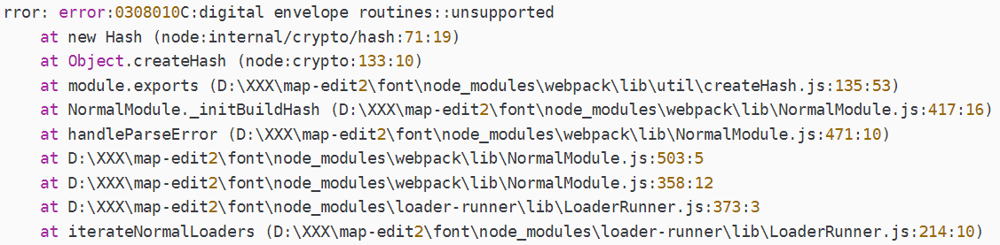

 vuepress官网：[https://www.vuepress.cn/](https://www.vuepress.cn/) [https://vuepress.vuejs.org/](https://vuepress.vuejs.org/)

## 本地运行

在目录中建了Start.bat文件，双击运行就可以访问本地部署效果。

在目录中，按Alt+d键，输入cmd，然后在控制台面板输入Start.bat，回车运行。

修改目录结构后需要重新运行，按两次Ctrl+c键停止运行，按光标向上键执行历史最近一条命令，重新运行。

```bash
npm run docs:dev
```

## 同步

1.运行Push提交所有文件

2.运行deploy生成静态网页并提交所有静态网页

3.运行Push提交所有文件

4.删除所有文件

## 克隆项目

`git branch -a` 查看所有分支；`git checkout master`切换到 master 分支；

`git clone -b 分支名 --single-branch <repository URL>`只克隆特定分支。

```bash
C:\Users\Administrator\Desktop\临时文件\zicl\vuepress>git clone https://github.com/zichenlbl/vuepress.git
Cloning into 'vuepress'...
remote: Enumerating objects: 23841, done.
remote: Counting objects: 100% (776/776), done.
remote: Compressing objects: 100% (322/322), done.
remote: Total 23841 (delta 458), reused 700 (delta 396), pack-reused 23065Receiving objects: 100% (23841/23841), 43.01 MiB | 4.29 MiB/s, done.

Resolving deltas: 100% (4276/4276), done.

C:\Users\Administrator\Desktop\临时文件\zicl\vuepress>cd vuepress

C:\Users\Administrator\Desktop\临时文件\zicl\vuepress\vuepress>git status
On branch gh-pages
Your branch is up to date with 'origin/gh-pages'.

nothing to commit, working tree clean

C:\Users\Administrator\Desktop\临时文件\zicl\vuepress\vuepress>git branch -a
* gh-pages
  remotes/origin/HEAD -> origin/gh-pages
  remotes/origin/gh-pages
  remotes/origin/master

C:\Users\Administrator\Desktop\临时文件\zicl\vuepress\vuepress>git checkout master
Updating files: 100% (23827/23827), done.
Switched to a new branch 'master'
branch 'master' set up to track 'origin/master'.

C:\Users\Administrator\Desktop\临时文件\zicl\vuepress\vuepress>git branch -a
  gh-pages
* master
  remotes/origin/HEAD -> origin/gh-pages
  remotes/origin/gh-pages
  remotes/origin/master

C:\Users\Administrator\Desktop\临时文件\zicl\vuepress\vuepress>
```

## 运行错误解决

出现错误：



原因： nodeJs V17 版本发布了 OpenSSL3.0 对算法和秘钥大小增加了更为严格的限制，nodeJs v17 之前版本没影响，但 V17 和之后版本会出现这个错误。 

解决：cmd 运行 set NODE_OPTIONS=--openssl-legacy-provider ，然后正常运行项目。

## 部署错误解决


在 package.json 文件中更改 scripts，docs:build 时先设置 NODE_OPTIONS 环境变量，并启用 OpenSSL 1.0.x 的兼容模式，从而避免 opensslErrorStack 错误的出现。 

```json
"scripts": {
    "test": "echo \"Error: no test specified\" && exit 1",
    "docs:dev": "SET NODE_OPTIONS=--openssl-legacy-provider && vuepress dev docs",
	"docs:build": "SET NODE_OPTIONS=--openssl-legacy-provider && vuepress build docs"
},
```


## 安装插件

### 返回顶部

返回顶部插件：https://vuepress.vuejs.org/zh/plugin/official/plugin-back-to-top.html

1. 安装

   `cnpm install -D @vuepress/plugin-back-to-top`

2. 配置文件使用插件

   `plugins: ['@vuepress/back-to-top']`

