# 安装 apache

## Windows 安装 apache

### 1.1 下载 apache 压缩包

官网：[https://apache.org/](https://apache.org/)

点击 Downloads 下面的 Distributions 跳转到下载界面。 

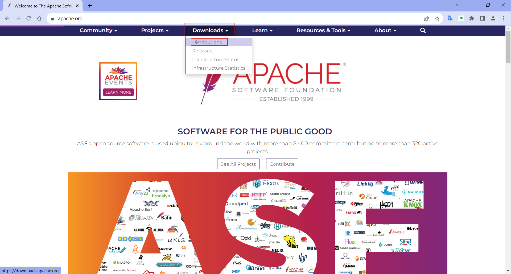

找到 httpd ，点击进入 httpd 。

点击 [Apache HTTP Server Download Page](http://httpd.apache.org/download.cgi) 。

点击下载Windows版本。

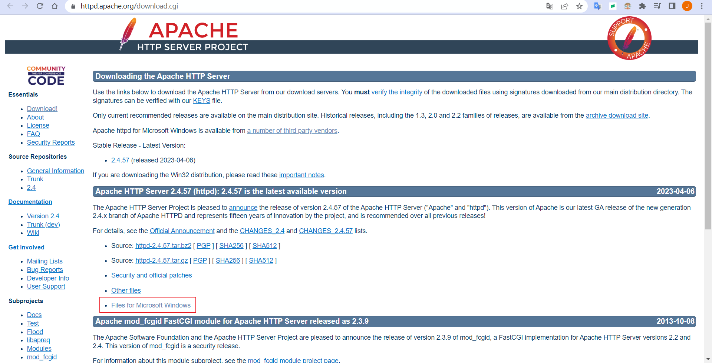

点击第一个。

跳转到页面。

选择适合的版本，如vs16用vs2019创建的版本，x64位。点击图标下载。

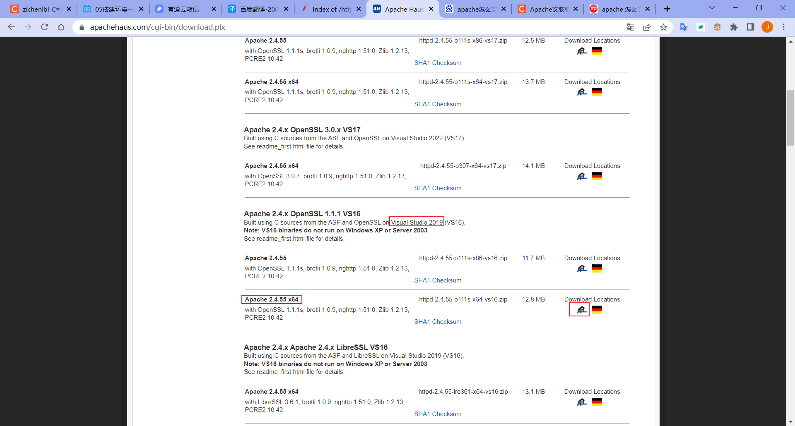

保存。

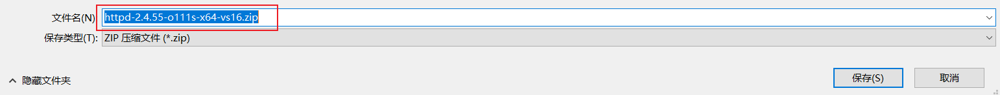

保存后的文件。

未自动下载可点击进行下载。

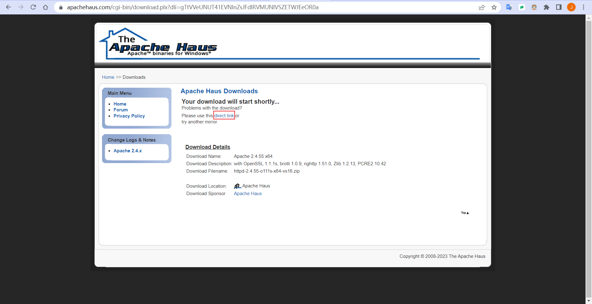

### 1.2 解压到文件夹

解压到 D:\ProgramFiles\apache\。

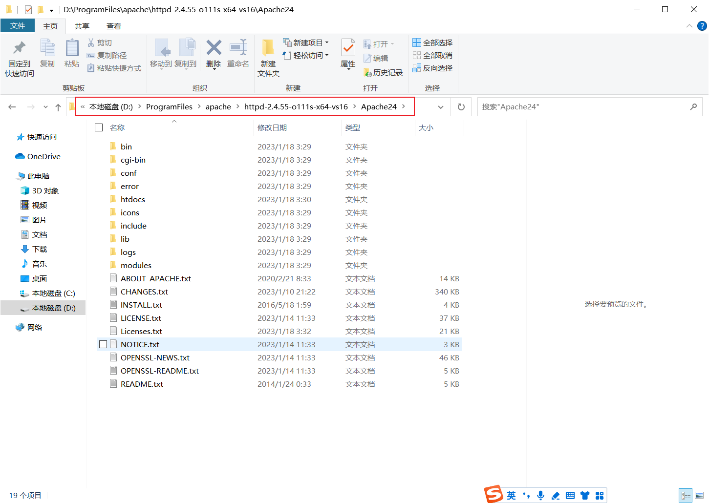

### 1.3 修改配置文件

修改 conf 目录下的 httpd.conf 文件。

修改 SRVROOT 为安装的路径，注释原来的配置，添加一行。

修改 apache 端口为 90 。

查看配置文件，SSL 端口配置在 conf/extra/httpd-ahssl.conf 文件中。

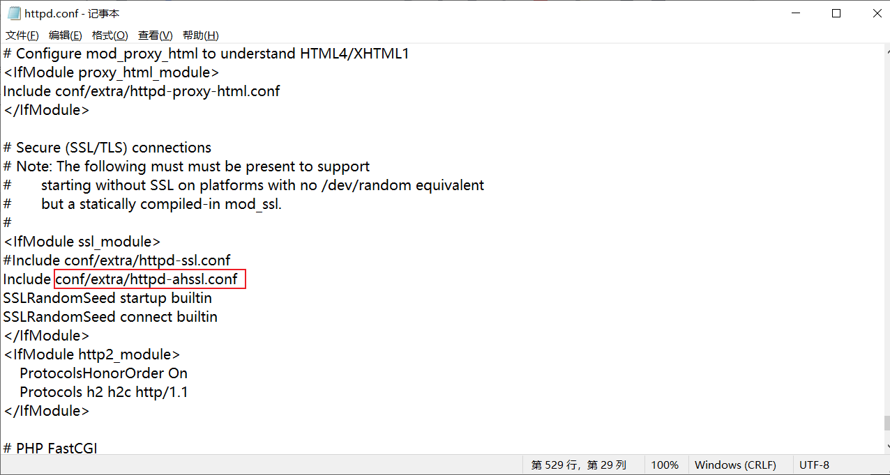

修改 conf/extra/httpd-ahssl.conf 文件，修改 Listen 端口为 456 。

### 1.4 安装 Apache 的 Windows 服务

进入 apache 的 bin 目录中，在地址栏中输入 cmd 按回车。

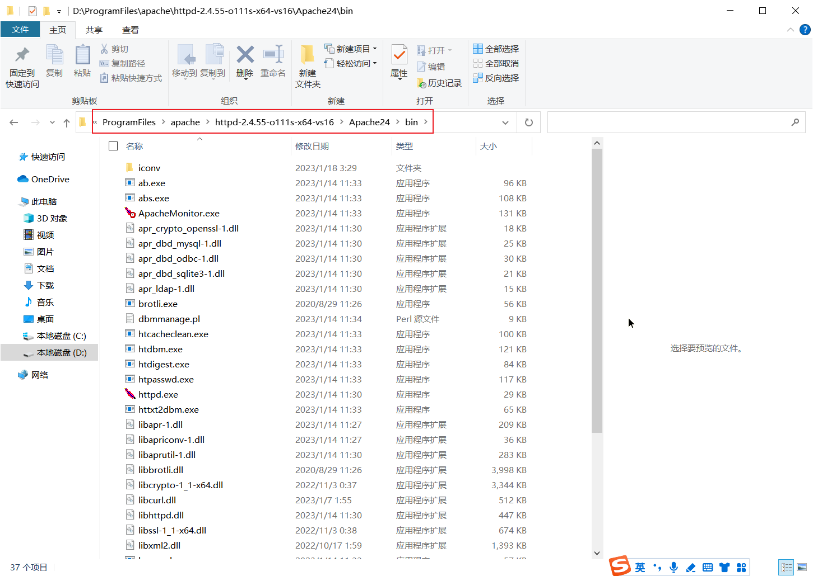

输入 cmd ，然后按回车。

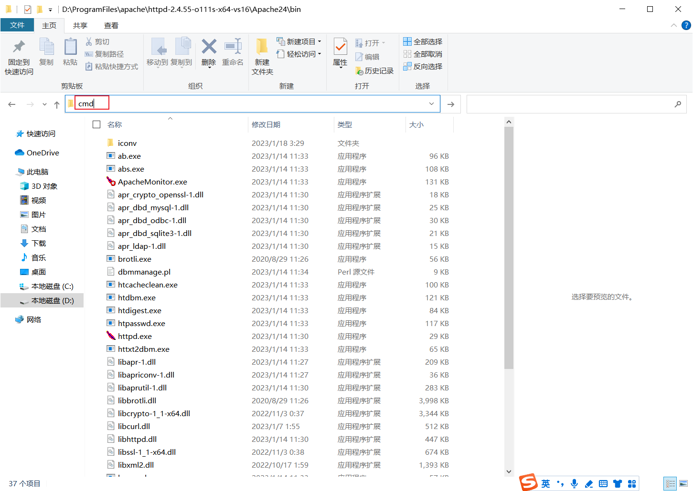

就会打开 cmd 命令提示符，并自动定位在当前文件夹。

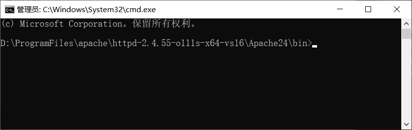

输入 httpd.exe -k install -n apache-zc 安装一个名叫 apache-zc 的服务。

httpd.exe -t 检查配置文件是否错误，返回语法OK。

net start apache-zc 启动一个名叫 apache-zc 的 Windows 服务。

win + r 输入 services.msc ，打开服务，找到安装的 Windows 服务。

### 1.5 访问网页

打开浏览器，访问配置的 http://localhost:90 、http://localhost:456 端口，打开 apache 测试页。

这个网页文件在Apache安装目录 \htdocs\ 下。

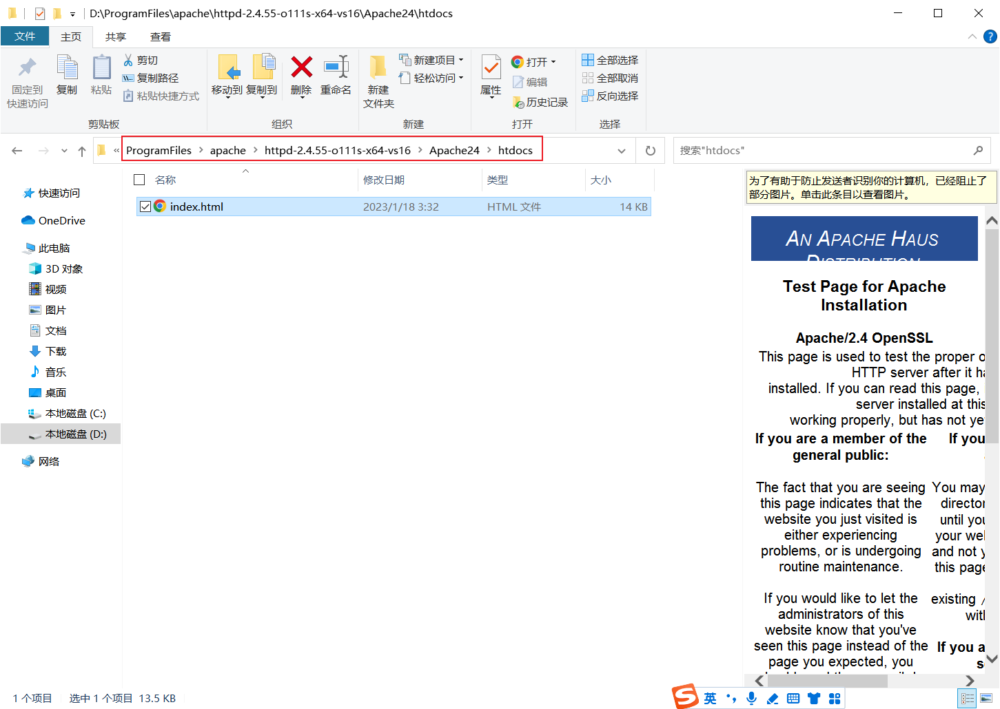

### 1.6 使用 Windows 服务管理服务

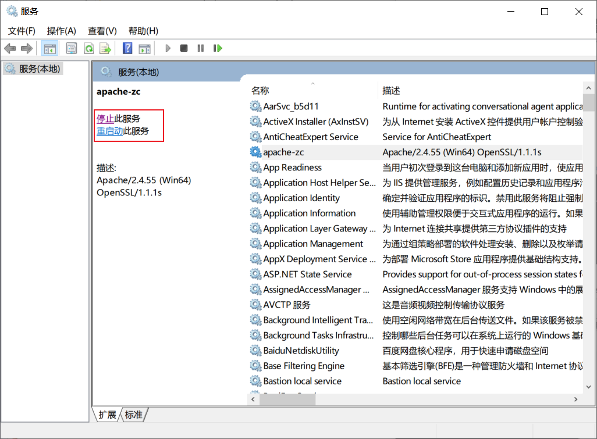

### 1.7 使用 ApacheMonitor 管理服务

打开 ApacheMonitor.exe 。

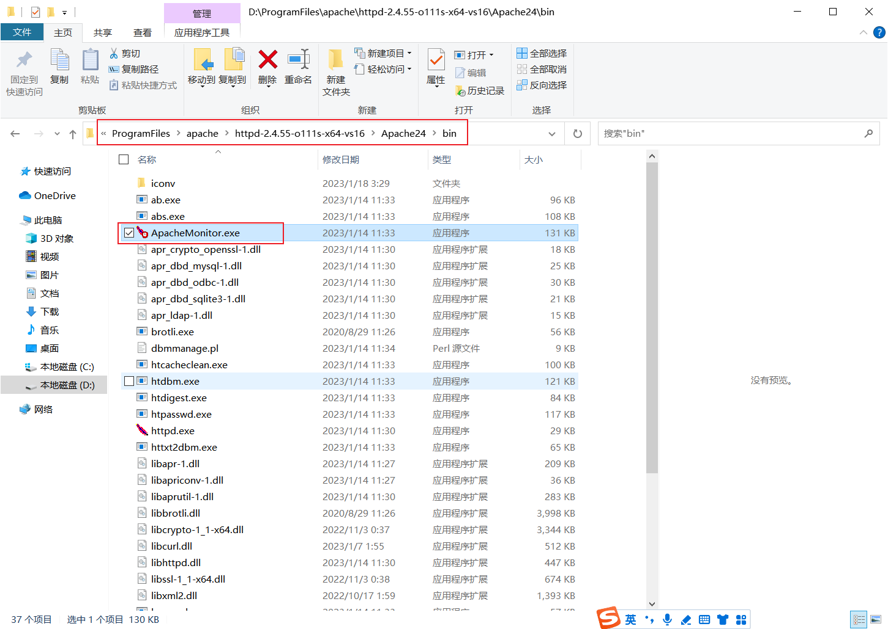

右下角托盘，在图标上右键打开。

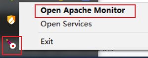

点击 Stop 停止（Start 启动、Restart 重启） apache-zc 服务。

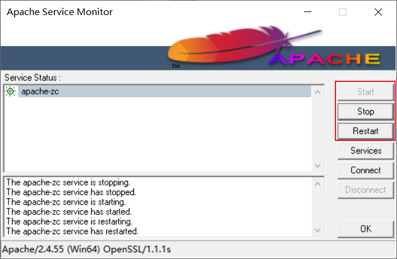

### 1.8 使用 cmd 命令提示符管理服务

#### 1.8.1 启动服务

net start 服务名

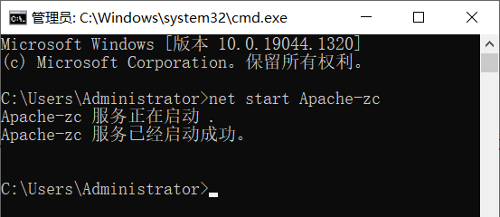

#### 1.8.2 停止服务

net stop 服务名

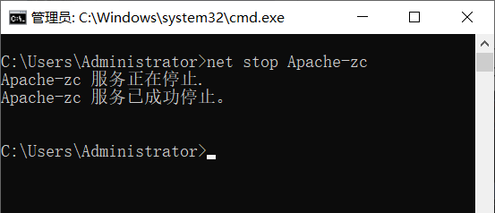

#### 1.8.3 删除服务

sc delete 服务名

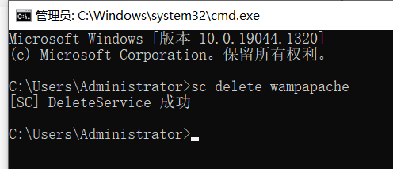

#### 1.8.4 重启服务

httpd.exe -k restart -n 服务名

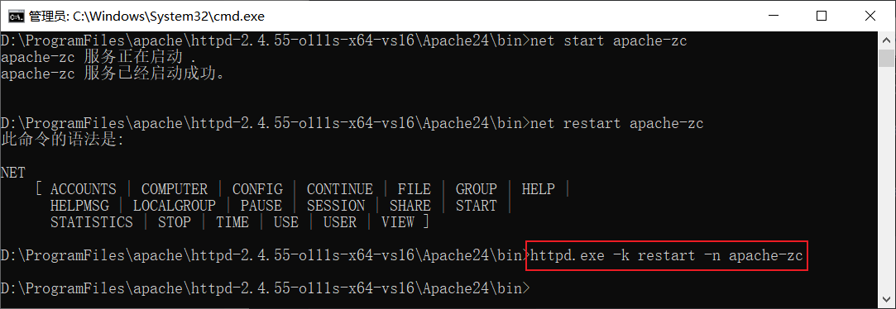

