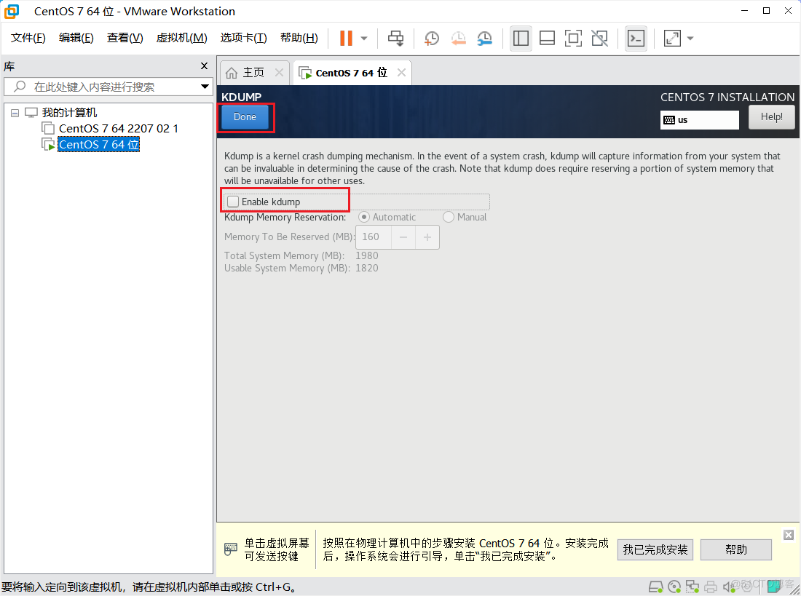
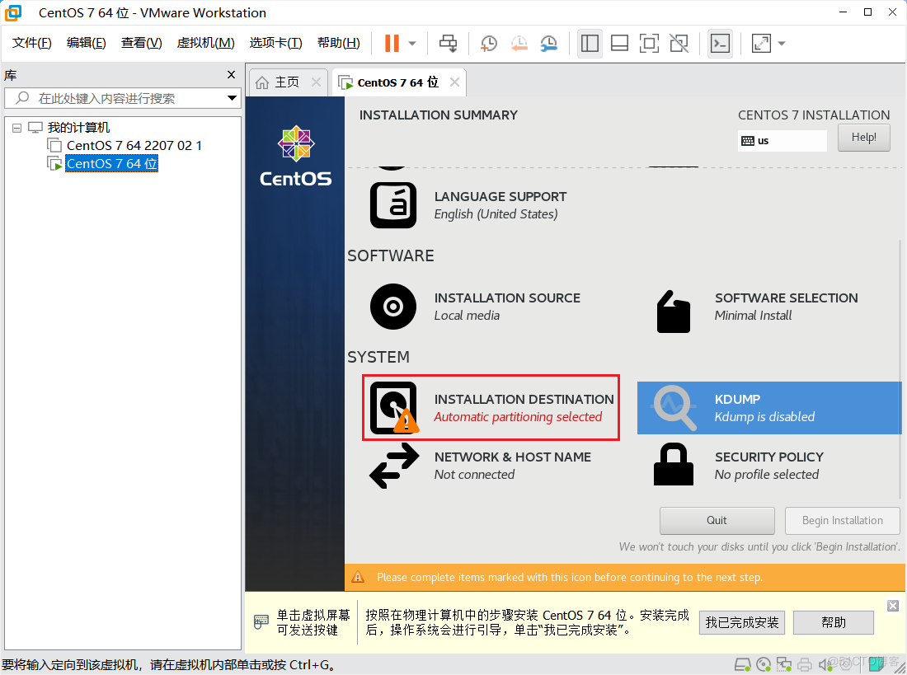

# 安装虚拟机

## VMware 安装 CentOS 7 虚拟机

### 1.1 下载 CentOS 7 ISO 文件

> [https://www.cnblogs.com/wh445306/p/16751695.html](https://www.cnblogs.com/wh445306/p/16751695.html)

CentOS 官网下载：[https://www.centos.org/download](https://www.centos.org/download)


从镜像站下载 ISO 文件：
1. [http://mirrors.aliyun.com](http://mirrors.aliyun.com)（阿里云镜像站）
2. [https://mirrors.tuna.tsinghua.edu.cn](https://mirrors.tuna.tsinghua.edu.cn)（清华大学镜像站）
3. [http://mirrors.sohu.com](http://mirrors.sohu.com)（搜狐镜像站）
4. [http://mirrors.163.com](http://mirrors.163.com)（网易镜像站）

使用阿里云镜像站下载，访问 [http://mirrors.aliyun.com](http://mirrors.aliyun.com)，选择 OS 镜像。


选择发行版 centos，选择版本 7(x86_64-DVD-2207-02)，点击下载。或者复制下载地址进行下载：[https://mirrors.aliyun.com/centos/7.9.2009/isos/x86_64/CentOS-7-x86_64-DVD-2207-02.iso](https://mirrors.aliyun.com/centos/7.9.2009/isos/x86_64/CentOS-7-x86_64-DVD-2207-02.iso)


下载完后的 ISO 文件。


### 1.2 安装 CentOS 7 虚拟机


### 1.3 开启虚拟机

开机。


鼠标点击黑色界面，把鼠标定位到虚拟机中，然后按上下方向键选中 Install CentOS 7。


然后按Tab键，出现下面这一行信息。


然后按两下空格，输入net.ifnames=0 biosdevname=0（网卡的名字设为0）


然后按回车。


### 1.4 安装系统

安装。


点击时间，选上海时间。


调整时间。


点击安装方式。


最小化安装，然后安装右边几个。


关闭安全。


取消勾选。



### 1.5 分区磁盘

设置磁盘。



选择手动配置，然后点击保存。


设置 /boot 大小。


设置 swap 大小，一般为内存的 1.5 倍。


设置 / 根目录大小，剩下的全部给根目录。


保存。


### 1.6 设置网络

网络配置。


点击自定义。


设置 ip 地址。


可以修改主机名字。


修改后保存，名字不能有下划线。


下一步。


### 1.7 设置 root 密码

设置 root 用户的密码，我的密码设置为 123456。


点两次保存。


等待安装……


### 1.8 重启登录系统

点击重启。


选择启动项。


输入用户名 root ，按回车，输入密码 123456，密码不显示输完按回车。


进入系统。


输入init 0 关机。


### 1.9 配置虚拟网络编辑器

配置网络。


开启虚拟机，检查虚拟机能否上网，ping qq.com，按 Ctrl+C 结束 ping，访问时间 32 毫秒。


### 1.10 Xshell 连接虚拟机

使用 Xshell 连接虚拟机。


连接成功。


### 1.11 关闭 SELinux

使用虚拟机测试时可以关闭 SELinux 和防火墙，但是正式服务器要开启，并开放端口访问等。

- 关闭防火墙

  ```bash
  systemctl stop firewalld.service
  systemctl disable firewalld.service
  ```

- 关闭 SELinux

  ```bash
  vi /etc/selinux/config
  ```
  把 SELINUX=enforcing 修改为 SELINUX=disabled

- 将 SELinux 的模式临时设置为 Permissive
  setenforce 0

- 查看当前的 SELinux 模式
  getenforce

- 关闭动态网络配置
  systemctl stop NetworkManager
  systemctl disable NetworkManager
  systemctl status NetworkManager

- 修改完成后重启 
  reboot

---

Email：zicl@qq.com

Copyright 2023-2024 Zichen

Licensed under the Apache License, Version 2.0 (the “License”);
you may not use this file except in compliance with the License.
You may obtain a copy of the License at

<a target="_blank" href="http://www.apache.org/licenses/LICENSE-2.0">http://www.apache.org/licenses/LICENSE-2.0</a>

Unless required by applicable law or agreed to in writing, software
distributed under the License is distributed on an “AS IS” BASIS,
WITHOUT WARRANTIES OR CONDITIONS OF ANY KIND, either express or implied.
See the License for the specific language governing permissions and
limitations under the License.