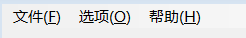

# csharp

## Winform

### 读取/写入ini配置文件

configuration.ini

```ini
[Video]
Url=https://www.bilibili.com/video/
VideoBVNumber0=BV19u411e7xa
VideoBVNumber1=BV1wS4y1N7qB
VideoBVNumber2=BV1qc411J7o2
VideoBVNumber3=BV1Mz4y1Y7FX
VideoBVNumber4=BV1rm4y1y7qh
VideoBVNumber5=BV1oc411J7wP
VideoBVNumber6=BV1jP411U7Xu
VideoBVNumber7=BV1Tv4y1J7zk
VideoBVNumber8=BV15c411g7mQ
VideoDuration=5
```

winform读取ini配置的值：

```csharp
// 读取ini文件
[System.Runtime.InteropServices.DllImport("kernel32")]
private static extern int GetPrivateProfileString(string section, string key, string def, System.Text.StringBuilder retVal, int size, string filePath);

// 写入ini文件
[System.Runtime.InteropServices.DllImport("kernel32")]
private static extern long WritePrivateProfileString(string section, string key, string val, string filePath);

private void button_Click(object sender, EventArgs e)
{
    StringBuilder temp = new StringBuilder(500);
    // 读取，读取到的长度
    int bilibiliUrlLength = GetPrivateProfileString("Video", "Url", "", temp, 100, Application.StartupPath + "\\configuration.ini");
    // 没读取到
    if (bilibiliUrlLength < 1)
    {
        // 写入空值，1:true，0:false
        long result = WritePrivateProfileString("Video", "Url", "", Application.StartupPath + "\\configuration.ini");
    }
    Console.WriteLine(temp.ToString());
}
```

### 按下按键

winform按下键盘上指定的键

```csharp
[System.Runtime.InteropServices.DllImport("user32.dll")]
public static extern void keybd_event(byte bVk, byte bScan, int dwFlags, int dwExtraInfo);

[System.Runtime.InteropServices.DllImport("user32.dll")]
private static extern void keybd_event(System.Windows.Forms.Keys key, int scanCode, uint flags, int extraInfo);

private void button_Click(object sender, EventArgs e)
{
    // 释放键标志位
    const int KEYEVENTF_KEYUP = 0x0002; 
    // 49对应键盘1
    byte key = (byte)49;

    // 按下Ctrl
    keybd_event(Keys.ControlKey, 0, 0, 0);
    // 按下1
    keybd_event(key, 0, 0, 0);

    // 松开Ctrl
    keybd_event(Keys.ControlKey, 0, KEYEVENTF_KEYUP, 0);
    // 松开1
    keybd_event(key, 0, KEYEVENTF_KEYUP, 0);
}
```

### 委托改label文本值

```csharp
/// <summary>
/// 追加textbox文字方法
/// </summary>
/// <param name="log"></param>
private void SetLogTextAdd(string log)
{
    textBox1.Text += log;
    // 选定文本的起始点
    textBox1.SelectionStart = textBox1.Text.Length;
    // 设置文本框中选定的字符数
    textBox1.SelectionLength = 0;
    // 滚动到当前插入字符的位置
    textBox1.ScrollToCaret();
}

/// <summary>
/// 设置textbox文字委托
/// </summary>
/// <param name="str"></param>
public delegate void SetLogTextDelegate(string str);

// 点击按钮修改textBox1的内容
private void button3_Click(object sender, EventArgs e)
{
    SetLogTextDelegate setLogText = new SetLogTextDelegate(SetLogTextAdd);
    if (textBox1.InvokeRequired)
    {
        textBox1.Invoke(setLogText, new object[] { "\r\n准备运行" });
    }
    else
    {
        textBox1.Text += "\r\n准备运行";
    }
}
```

### 读取pdf转base64

pdf文件：测试读取pdf转base64.pdf

```csharp
//测试读取pdf转
byte[] mBytes = System.IO.File.ReadAllBytes("测试读取pdf转base64.pdf");
string mBase64String = Convert.ToBase64String(mBytes);
Console.WriteLine(mBase64String);
```

### 关闭窗体时取消关闭

```csharp
/// <summary>
/// 窗体关闭确认前事件
/// </summary>
/// <param name="sender"></param>
/// <param name="e"></param>
private void Form1_FormClosing(object sender, FormClosingEventArgs e)
{
    // 取消关闭事件
    e.Cancel = true;
    // 最小化窗口
    this.WindowState = FormWindowState.Minimized;
}
```

### 显示托盘

往窗体上拖一个notifyIcon1组件，然后设置notifyIcon1属性的Icon图标，然后运行窗体，就在托盘显示图标了。

### 在控件上显示提示

往窗体上拖一个toolTip1组件，然后在按钮的鼠标移入事件中写代码：

```csharp
private void button1_MouseEnter(object sender, EventArgs e)
{
    toolTip1.SetToolTip(button1, "我是按钮");
}
```

### 设置状态栏进度条

新建TaskbarProgress类。

```csharp

public static class TaskbarProgress
{
    public enum TaskbarStates
    {
        NoProgress = 0,
        Indeterminate = 0x1,
        Normal = 0x2,
        Error = 0x4,
        Paused = 0x8
    }

    [ComImport()]
    [Guid("ea1afb91-9e28-4b86-90e9-9e9f8a5eefaf")]
    [InterfaceType(ComInterfaceType.InterfaceIsIUnknown)]
    private interface ITaskbarList3
    {
        // ITaskbarList
        [PreserveSig]
        void HrInit();
        [PreserveSig]
        void AddTab(IntPtr hwnd);
        [PreserveSig]
        void DeleteTab(IntPtr hwnd);
        [PreserveSig]
        void ActivateTab(IntPtr hwnd);
        [PreserveSig]
        void SetActiveAlt(IntPtr hwnd);

        // ITaskbarList2
        [PreserveSig]
        void MarkFullscreenWindow(IntPtr hwnd, [MarshalAs(UnmanagedType.Bool)] bool fFullscreen);

        // ITaskbarList3
        [PreserveSig]
        void SetProgressValue(IntPtr hwnd, UInt64 ullCompleted, UInt64 ullTotal);
        [PreserveSig]
        void SetProgressState(IntPtr hwnd, TaskbarStates state);
    }

    [ComImport()]
    [Guid("56fdf344-fd6d-11d0-958a-006097c9a090")]
    [ClassInterface(ClassInterfaceType.None)]
    private class TaskbarInstance
    {
    }

    private static ITaskbarList3 taskbarInstance = (ITaskbarList3)new TaskbarInstance();
    private static bool taskbarSupported = Environment.OSVersion.Version >= new Version(6, 1);

    public static void SetState(IntPtr windowHandle, TaskbarStates taskbarState)
    {
        if (taskbarSupported) taskbarInstance.SetProgressState(windowHandle, taskbarState);
    }

    public static void SetValue(IntPtr windowHandle, double progressValue, double progressMax)
    {
        if (taskbarSupported) taskbarInstance.SetProgressValue(windowHandle, (ulong)progressValue, (ulong)progressMax);
    }
}
```

使用。

```csharp
TaskbarProgress.SetValue(this.Handle, 50, 100); // 设置50%进度条
TaskbarProgress.SetState(this.Handle, TaskbarProgress.TaskbarStates.Paused); // 设置状态为Paused
```

### 点击托盘退出按钮关闭程序

```csharp
private void 退出ToolStripMenuItem_Click(object sender, EventArgs e)
{
    // 终止此进程，并为基础操作系统提供指定的退出代码。
    Environment.Exit(0);
    // 该方法会通知所有消息泵必须终止，如果存在托管线程（非主线程），也无法干净退出
    //Application.Exit();
}
```

### 顶部菜单Alt快捷键

menuStrip1组件

ToolStripMenuItem的Text属性设置为：

```json
文件(&F)
```

按alt键，然后按F键就打开菜单文件。



### 颜色选择窗体

```csharp
ColorDialog cd = new ColorDialog();
cd.ShowDialog();
```

### 在任务栏中显示气球提示

往窗体上拖一个notifyIcon1组件，然后在代码中写：

```csharp
public Form1()
{
    InitializeComponent();
    this.notifyIcon1.ShowBalloonTip(1000, "标题", "内容", ToolTipIcon.Info); //显示气泡提示
}
```

## .net framework

### 文件转base64

```csharp
//测试读取pdf转base64
byte[] mBytes = System.IO.File.ReadAllBytes("测试读取pdf转base64.pdf");
string mBase64String = Convert.ToBase64String(mBytes);
Console.WriteLine(mBase64String);
```

### 读取xml指定节点的值（遍历子节点）

XMLFIle2.xml：

```xml
<?xml version="1.0" encoding="utf-8" ?>
<root>
  <messageHeader>
    <msgSource>发送系统</msgSource>
    <sender>发送者</sender>
    <receiver>UnionntPLMR</receiver>
    <sendTime>发送时间</sendTime>
    <msgType>病案状态</msgType>
    <msgCode>S034</msgCode>
    <msgId>通知主键</msgId>
  </messageHeader>
  <messageBody>
    <patientNo>住院唯一标识</patientNo>
    <districtCode>院区标识</districtCode>
    <result>结果（1/2）</result>
    <scode>状态编码（01/02/03……）</scode>
    <sname>状态名称</sname>
  </messageBody>
</root>
```

代码读取：

```csharp
System.Xml.XmlDocument doc = new System.Xml.XmlDocument();
doc.Load("XMLFIle2.xml");
System.Xml.XmlNode root = doc.DocumentElement;
// 读取根节点<root>下的子节点
foreach (System.Xml.XmlNode node in root.ChildNodes)
{
    // 处理子节点
    if (node.Name == "messageBody")
    {
        var a = node.ChildNodes;
        for (int i = 0; i < a.Count; i++)
        {
            if (a[i].Name == "scode")
            {
                Console.WriteLine(a[i].InnerText);
                /*
                // scode节点下还有子节点的话，通过这样获取
                for (int j = 0; j < a[i].ChildNodes.Count; j++)
                {
                    if (a[i].ChildNodes[j].Name == "staffName")
                    {
                        Console.WriteLine(a[i].ChildNodes[j].InnerText);
                    }
                }
                */
            }
        }
    }
}
```

### 读取xml指定节点的值（XPath表达式）

XMLFile3.xml

```xml
<?xml version="1.0" encoding="utf-8" ?>
<root>
  <id root="2.16.156.10011.2.5.1.1" extension="b7722265-cc05-4b72-b3ed-fe54b30a34c4"/>
  <!--@value消息发送时间-->
  <creationTime value="20210108153405"/>
  <interactionId root="2.16.156.10011.2.5.1.2" extension="POOR_IN200901UV"/>
  <processingCode code="P"/>
  <processingModeCode/>
  <acceptAckCode code="AL"/>
  <receiver typeCode="RCV">
    <device classCode="DEV" determinerCode="INSTANCE">
      <!--@extension接受者ID,root为固定值-->
      <id>
        <item root="2.16.156.10011.2.5.1.3" extension="ECG"/>
      </id>
      <id>
        <item root="2.16.156.10011.2.5.1.4" extension="ECG1"/>
      </id>
    </device>
  </receiver>
</root>
```

代码读取：

```csharp
XmlDocument xml = new XmlDocument();//实例化这个类
string path = @"XMLFile3.xml";
xml.Load(path);
string xmltxt = xml.InnerXml.ToString(); //获取xml文本
XmlDocument doc = new XmlDocument();//重新实例化一个XmlDocument用来加载xml文本
doc.LoadXml(xmltxt);
//GetElementsByTagName用来指定获取那个节点内容，会返回节点List集合
XmlNodeList xnList = doc.DocumentElement.GetElementsByTagName("id");
XmlNode xmlNode = doc.SelectSingleNode("root/receiver/device/id/item[@root='2.16.156.10011.2.5.1.4']");
if (xmlNode != null)
{
    // ECG1
    Console.WriteLine(xmlNode.Attributes["extension"].Value);
}
//通过这个集合下标的Attributes获取对应属性的值
// b7722265-cc05-4b72-b3ed-fe54b30a34c4
Console.WriteLine(xnList[0].Attributes["extension"].Value);
```

### 读取xml指定节点的值（有命名空间）

XMLFile4.xml

```xml
<?xml version="1.0" encoding="utf-8" ?>
<bookstore xmlns="http://example.books.com">
    <book genre="autobiography" publicationdate="1991" ISBN="1-861003-11-0">
        <title>The Autobiography of Benjamin Franklin</title>
        <author>
            <first-name>Benjamin</first-name>
            <last-name>Franklin</last-name>
        </author>
        <price>8.99</price>
    </book>
    <sp:book genre="novel" publicationdate="1967" ISBN="0-201-63361-2" xmlns:sp="http://example.book.org">
        <title>The Confidence Man</title>
        <author>
            <first-name>Herman</first-name>
            <last-name>Melville</last-name>
        </author>
        <price>11.99</price>
    </sp:book>
    <book genre="philosophy" publicationdate="1991" ISBN="1-861001-57-6">
        <title>The Gorgias</title>
        <author>
            <name>Plato</name>
        </author>
        <price>9.99</price>
    </book>
</bookstore>
```

代码读取：

```csharp
XmlDocument xmldoc = new XmlDocument();
xmldoc.Load(@"XMLFile4.xml");
XmlNamespaceManager xmlns = new XmlNamespaceManager(xmldoc.NameTable);
xmlns.AddNamespace("sd", "http://example.books.com"); // 默认的命名空间也要添加前缀
xmlns.AddNamespace("sp", "http://example.book.org");
XmlNode title = xmldoc.SelectSingleNode("/sd:bookstore/sp:book/sd:title", xmlns);
Console.WriteLine(title.InnerText); // The Confidence Man
Console.WriteLine(xmldoc.SelectSingleNode("/sd:bookstore/sd:book[@genre='philosophy']/sd:title", xmlns).InnerText); // The Gorgias
```

### 读取xml相同节点不同属性的值

last-name节点相同，type不同。

XMLFile5.xml

```xml
<?xml version="1.0" encoding="utf-8" ?>
<bookstore xmlns="http://example.books.com">
  <book genre="autobiography" publicationdate="1991" ISBN="1-861003-11-0">
    <title>The Autobiography of Benjamin Franklin</title>
    <author>
      <first-name>Benjamin</first-name>
      <last-name type="SAL">Franklin</last-name>
      <last-name type="SAL2">Franklin2</last-name>
    </author>
    <price>8.99</price>
  </book>
</bookstore>
```

代码读取：

```csharp
XmlDocument xmldoc = new XmlDocument();
xmldoc.Load(@"XMLFile5.xml");
XmlNamespaceManager xmlns = new XmlNamespaceManager(xmldoc.NameTable);
xmlns.AddNamespace("sd", "http://example.books.com");//默认的命名空间也要添加 前缀
XmlNode title = xmldoc.SelectSingleNode("/sd:bookstore/sd:book/sd:author/sd:last-name[@type='SAL2']", xmlns);
Console.WriteLine(title.InnerText); // Franklin2
```

### app.manifest

添加新项，选择应用程序清单文件。


### cpu使用率

1.创建.net framework2.0控制台项目。添加引用，选择程序集，选择System.Management然后点确定。

新建一个SystemInfo.cs类

```csharp
namespace TestConsoleApp
{
    class SystemInfo
    {
        /// <summary>
        /// CPU计数器
        /// </summary>
        private System.Diagnostics.PerformanceCounter cpuUsage;   // CPU计数器
        public float CpuUsage { get { return cpuUsage.NextValue(); }}

        public SystemInfo()
        {
            cpuUsage = new System.Diagnostics.PerformanceCounter("Processor", "% Processor Time", "_Total");
            cpuUsage.MachineName = ".";
            cpuUsage.NextValue();

            System.Threading.Thread.Sleep(1000);
        }
    }
}
```

获取cpu使用率：

```csharp
Console.WriteLine("Hello World!");

var cpu = new SystemInfo().CpuUsage;
Console.WriteLine("SystemInfo cpu使用率：" + cpu); // SystemInfo cpu使用率：26.88997

Console.ReadKey();
```

### cpu逻辑处理器数

```csharp
Console.WriteLine("cpu逻辑处理器数：" + Environment.ProcessorCount); // cpu处理器数：12
```

### ram大小

```csharp
var ram = 0L;
System.Management.ManagementClass managementClass = new System.Management.ManagementClass("Win32_ComputerSystem");
System.Management.ManagementObjectCollection managements = managementClass.GetInstances();
foreach (System.Management.ManagementObject management in managements)
{
    if (management["TotalPhysicalMemory"] != null)
    {
        ram = long.Parse(management["TotalPhysicalMemory"].ToString());
    }
}
Console.WriteLine("内存：" + (ram * 1.00 / 1024 / 1024 / 1024).ToString("F2") + "GB"); // 内存：15.75GB
```

### ram可用大小

```csharp
long availableRam = 0L;
System.Management.ManagementClass mos = new System.Management.ManagementClass("Win32_OperatingSystem");
foreach (System.Management.ManagementObject mo in mos.GetInstances())
{
    if (mo["FreePhysicalMemory"] != null)
    {
        availableRam = long.Parse(mo["FreePhysicalMemory"].ToString());
    }
}
Console.WriteLine("可用内存：" + (availableRam * 1.00 / 1024 / 1024).ToString("F2") + "GB"); // 可用内存：2.68GB

```

### ram已用大小

ram大小 - ram可用大小 = ram已用大小

```csharp
Console.WriteLine("已用内存：" + ((ram * 1.00 / 1024 - availableRam * 1.00) / 1024 / 1024).ToString("F2") + "GB"); // 已用内存：13.07GB
```

### 硬盘信息

```csharp
// 获取硬盘信息
System.IO.DriveInfo[] drive = System.IO.DriveInfo.GetDrives(); // 获取所有驱动器
for (int i = 0; i < drive.Length; i++) // 遍历驱动器
{
    Console.WriteLine(drive[i].Name); // C:\
    Console.WriteLine(drive[i].DriveFormat); // NTFS
    Console.WriteLine("总空间：" + (drive[i].TotalSize * 1.00 / 1024 / 1024 / 1024).ToString("F2") + "GB"); // 总空间：300.00GB
    Console.WriteLine("剩余空间：" + (drive[i].TotalFreeSpace * 1.00 / 1024 / 1024 / 1024).ToString("F2") + "GB"); // 剩余空间：72.50GB
    Console.WriteLine("已用空间：" + ((drive[i].TotalSize - drive[i].TotalFreeSpace) * 1.00 / 1024 / 1024 / 1024).ToString("F2") + "GB"); // 已用空间：227.50GB
}
```

### 本地ip地址

```csharp
System.Net.IPHostEntry ipEntry = System.Net.Dns.GetHostEntry(System.Net.Dns.GetHostName());
Console.WriteLine("主机名：" + ipEntry.HostName); // 主机名：USER-20221130QZ
foreach (var ip in ipEntry.AddressList)
{
    Console.WriteLine("IP Address: " + ip.ToString()); // IP Address: 192.168.62.125
}
```

### 网卡mac地址

```csharp
foreach (System.Net.NetworkInformation.NetworkInterface nic in System.Net.NetworkInformation.NetworkInterface.GetAllNetworkInterfaces())
{
    string macAddress;
    // 网络接口已打开，可以传输数据
    if (nic.OperationalStatus == System.Net.NetworkInformation.OperationalStatus.Up)
    {
        macAddress = nic.GetPhysicalAddress().ToString();
        if (macAddress.Length > 11)
            macAddress = macAddress.Insert(2, ":").Insert(5, ":").Insert(8, ":").Insert(11, ":").Insert(14, ":");
        Console.WriteLine("UP:  " + macAddress); // UP:  B4:45:06:88:2C:62
    }
    // 网络接口无法传输数据
    if (nic.OperationalStatus == System.Net.NetworkInformation.OperationalStatus.Down)
    {
        macAddress = nic.GetPhysicalAddress().ToString();
        if (macAddress.Length > 11)
            macAddress = macAddress.Insert(2, ":").Insert(5, ":").Insert(8, ":").Insert(11, ":").Insert(14, ":");
        Console.WriteLine("Down:" + macAddress); // Down:1E:C1:0C:C0:6D:9F
    }
}
```

### 根据生日计算年龄

```csharp
/// <summary>
/// 从生日计算年龄
/// </summary>
/// <param name="birthday">生日</param>
/// <param name="ageType">年龄单位</param>
/// <returns></returns>
int f_ConvertBirthdayToAge(string birthday,string ageType)
{
    try
    {
        DateTime date = Convert.ToDateTime(txt_dbirthday.Text);
        int age = 0;
        switch (ageType)
        {

            case "月":
                {
                    age = DateTime.Now.Year - date.Year;
                    if (DateTime.Now.Month < date.Month)
                    {
                        age--;
                        age = age * 12 + date.Month - DateTime.Now.Month;
                    }
                    else
                    {
                        age = age * 12 + DateTime.Now.Month - date.Month;
                    }
                    break;
                }
            case "天":
                {
                    age = (DateTime.Now - date).Days;
                    break;
                }
            case "小时":
                {
                    age = (DateTime.Now - date).Hours;
                    break;
                }
            case "分":
                {
                    age = (DateTime.Now - date).Minutes;
                    break;
                }
            case "岁":

            default:
                {
                    age = DateTime.Now.Year - date.Year;
                    if (DateTime.Now.Month < date.Month) age--;
                    break;
                }

        }
        if (age < 0) age = 0;
        return age;
    }
    catch (Exception ex)
    {
        logHelper.WriteLine("f_ConvertBirthdayToAge方法中，生日不正确:" + txt_dbirthday.Text + ";ex:" + ex.Message);
        return 0;
    }
}
```


Other

```csharp
//打开图片
private void button1_Click(object sender, EventArgs e)
{
    openFileDialog1.Filter = "jpg,bmp,gif|*.jpg;*.gif;*.bmp";
    if (openFileDialog1.ShowDialog() == DialogResult.OK)
    {
        pictureBox1.ImageLocation = openFileDialog1.FileName;
    }
}
//打开加密文件
private void button2_Click(object sender, EventArgs e)
{
    openFileDialog1.Filter = "文本文件|*.txt";
    if (openFileDialog1.ShowDialog() == DialogResult.OK)
    {
        textBox1.Text = openFileDialog1.FileName;
    }
}
// 加密
private void button3_Click(object sender, EventArgs e)
{
    try
    {
        if (pictureBox1.ImageLocation == null)
        { MessageBox.Show("请选择一幅图片用于加密"); return; }
        if (textBox1.Text == "")
        { MessageBox.Show("请选择加密文件路径"); return; }
        //图片流
        FileStream fsPic = new FileStream(pictureBox1.ImageLocation, FileMode.Open, FileAccess.Read);
        //加密文件流
        FileStream fsText = new FileStream(textBox1.Text, FileMode.Open, FileAccess.Read);
        //初始化Key IV
        byte[] bykey = new byte[16];
        byte[] byIv = new byte[8];
        fsPic.Read(bykey, 0, 16);
        fsPic.Read(byIv, 0, 8);
        //临时加密文件
        string strPath = textBox1.Text;//加密文件的路径
        int intLent = strPath.LastIndexOf("\\") + 1;
        int intLong = strPath.Length;
        string strName = strPath.Substring(intLent, intLong - intLent);//要加密的文件名称
        string strLinPath = "C:\\" + strName;//临时加密文件路径，所以被加密的文件不可以放在C盘的根目录下
        FileStream fsOut = File.Open(strLinPath, FileMode.Create, FileAccess.Write);
        //开始加密
        RC2CryptoServiceProvider desc = new RC2CryptoServiceProvider();//des进行加
        BinaryReader br = new BinaryReader(fsText);//从要加密的文件中读出文件内容
        CryptoStream cs = new CryptoStream(fsOut, desc.CreateEncryptor(bykey, byIv), CryptoStreamMode.Write);//写入临时加密文件
        cs.Write(br.ReadBytes((int)fsText.Length), 0, (int)fsText.Length);//写入加密流
        cs.FlushFinalBlock();
        cs.Flush();
        cs.Close();
        fsPic.Close();
        fsText.Close();
        fsOut.Close();
        File.Delete(textBox1.Text.TrimEnd());//册除原文件
        File.Copy(strLinPath, textBox1.Text);//复制加密文件
        File.Delete(strLinPath);//册除临时文件
        MessageBox.Show("加密成功");
        pictureBox1.ImageLocation = null;
        textBox1.Text = "";
    }
    catch (Exception ee)
    {
        MessageBox.Show(ee.Message);
    }

}

//解密
private void button4_Click(object sender, EventArgs e)
{
    try
    {
        //图片流
        FileStream fsPic = new FileStream(pictureBox1.ImageLocation, FileMode.Open, FileAccess.Read);
        //解密文件流
        FileStream fsOut = File.Open(textBox1.Text, FileMode.Open, FileAccess.Read);
        //初始化Key IV
        byte[] bykey = new byte[16];
        byte[] byIv = new byte[8];
        fsPic.Read(bykey, 0, 16);
        fsPic.Read(byIv, 0, 8);
        //临时解密文件
        string strPath = textBox1.Text;//加密文件的路径
        int intLent = strPath.LastIndexOf("\\") + 1;
        int intLong = strPath.Length;
        string strName = strPath.Substring(intLent, intLong - intLent);//要加密的文件名称
        string strLinPath = "C:\\" + strName;//临时解密文件路径
        FileStream fs = new FileStream(strLinPath, FileMode.Create, FileAccess.Write);
        //开始解密
        RC2CryptoServiceProvider desc = new RC2CryptoServiceProvider();//des进行解
        CryptoStream csDecrypt = new CryptoStream(fsOut, desc.CreateDecryptor(bykey, byIv), CryptoStreamMode.Read);//读出加密文件
        BinaryReader sr = new BinaryReader(csDecrypt);//从要加密流中读出文件内容
        BinaryWriter sw = new BinaryWriter(fs);//写入解密流
        sw.Write(sr.ReadBytes(Convert.ToInt32(fsOut.Length)));//
        sw.Flush();
        sw.Close();
        sr.Close();
        fs.Close();
        fsOut.Close();
        fsPic.Close();
        csDecrypt.Flush();

        File.Delete(textBox1.Text.TrimEnd());//册除原文件
        File.Copy(strLinPath, textBox1.Text);//复制加密文件
        File.Delete(strLinPath);//册除临时文件
        MessageBox.Show("解密成功");
        pictureBox1.ImageLocation = null;
        textBox1.Text = "";
    }
    catch (Exception ee)
    {
        MessageBox.Show(ee.Message);
    }
}
```


