# 安装 mysql

## Windows 安装 mysql

### 1.1 下载 mysql 压缩包

进入官网：[https://www.mysql.com/](https://www.mysql.com/)

点击 DOWNLOADS 跳转到下载界面。

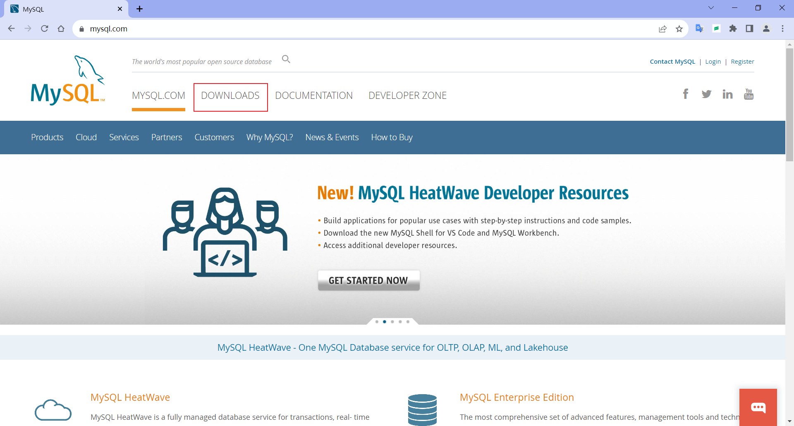

点击下载界面中的 [MySQL Community (GPL) Downloads »](https://dev.mysql.com/downloads/) 。


选择 MySQL Community Server 。

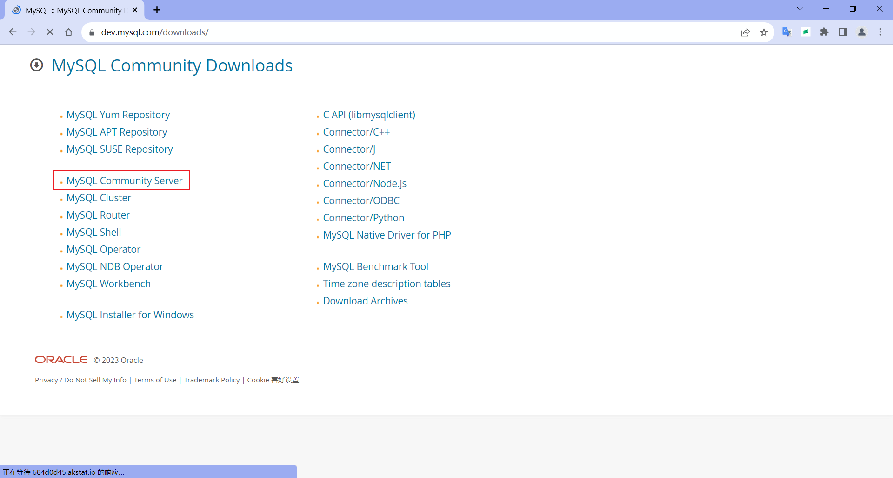

点击 Archives 查看档案中所有版本。

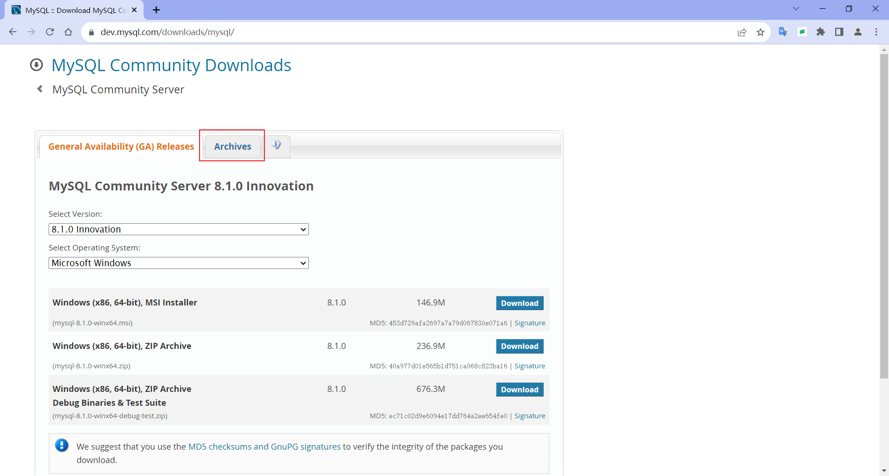

选择产品版本，选择操作系统，然后下载ZIP压缩包。


下载后的压缩包。


### 1.2 解压到指定的目录

解药到 D:\ProgramFiles\mysql\ 目录下。

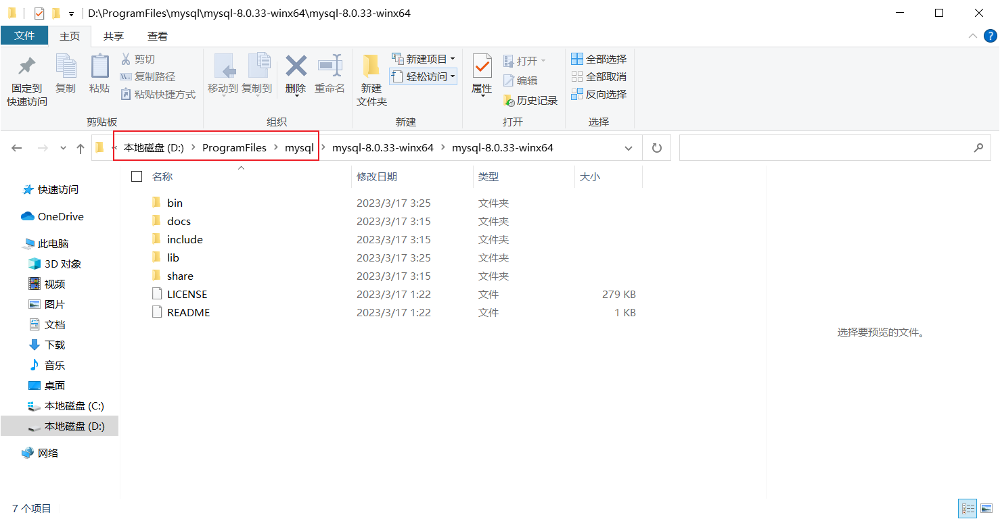

### 1.3 创建 my.ini 配置文件

在 \bin 目录同级下，创建 my.ini 文件。

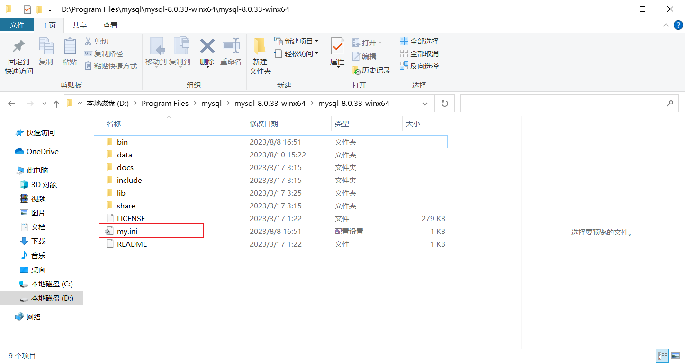

my.ini 文件内容。

```ini
[mysql]
#my.ini放在和\bin目录同级下
# 设置mysql客户端默认字符集
default-character-set=utf8
 
[mysqld]
# 设置3306端口
port = 3306
# 设置mysql的安装目录
basedir=D:\ProgramFiles\mysql\mysql-8.0.33-winx64\mysql-8.0.33-winx64
# 设置 mysql数据库的数据的存放目录，MySQL 8+ 不需要以下配置，系统自己生成即可，否则有可能报错
# datadir=D:\Mysql-8.0.11\mysql-8.0.11-winx64\data
# 允许最大连接数
max_connections=20
# 服务端使用的字符集默认为8比特编码的latin1字符集
character-set-server=utf8
# 创建新表时将使用的默认存储引擎
default-storage-engine=INNODB
```

### 1.4 初始化 mysql

进入 mysql 安装目录的 bin\ 文件夹，在地址栏中输入 cmd 按回车，打开命令提示符并定位到当前目录。

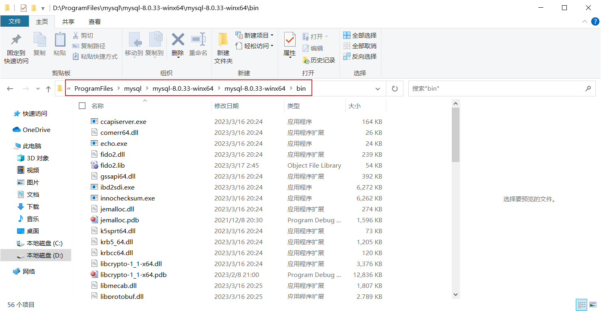

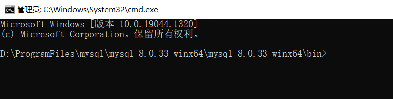

输入 mysqld.exe --initialize --console 初始化。初始化完成后，会生成一个临时密码。

选中密码，在窗体顶部右键，选择编辑，复制。稍后登录 mysql 时需要用到。

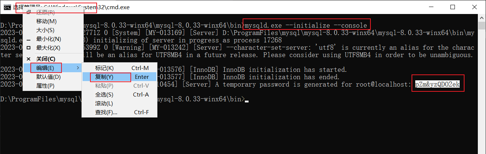

### 1.5 安装 mysql 服务

输入 mysqld.exe --install mysql-zc 安装名称为 mysql-zc 的服务。提示服务安装成功。


### 1.6 启动 mysql 服务

输入 net start mysql-zc ，启动名称为 mysql-zc 的服务。

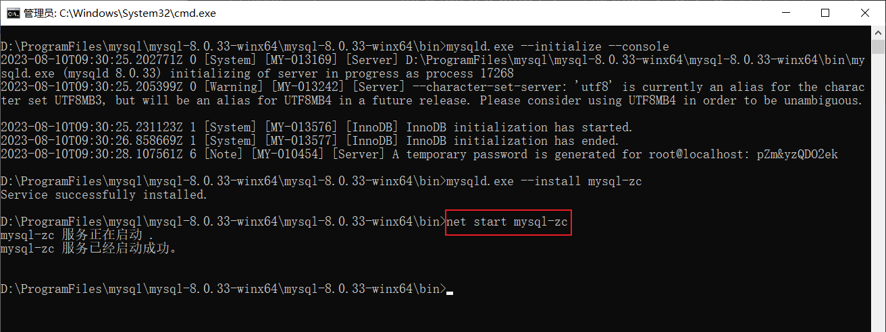

### 1.7 登录 mysql

输入 mysql.exe -uroot -p -P3306 ，按回车，粘贴临时密码，按回车。

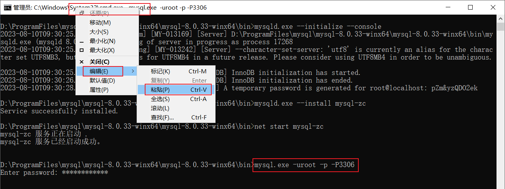

登录 mysql 。

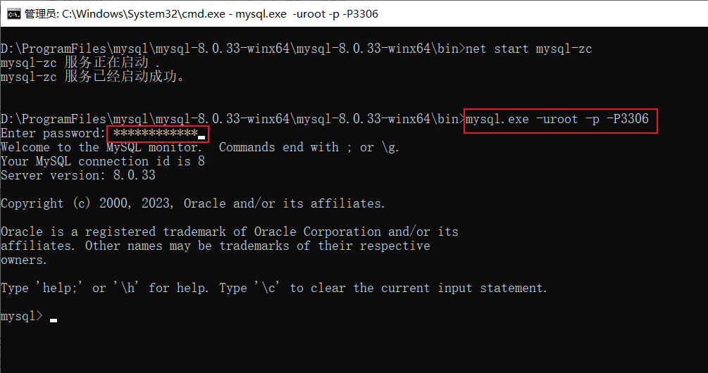

### 1.8 修改密码

修改 root 用户密码，输入 alter user 'root'@'localhost' identified with mysql_native_password by 'root'; 修改 root 用户的密码为 root 。

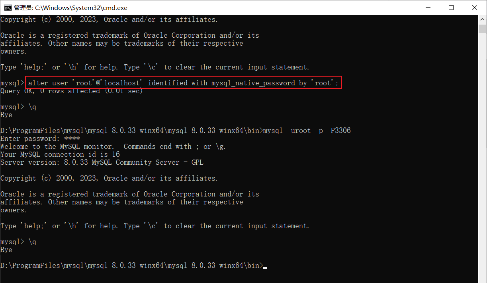

### 1.9 新密码登录

输入 \q 退出登录，然后使用新密码登录。

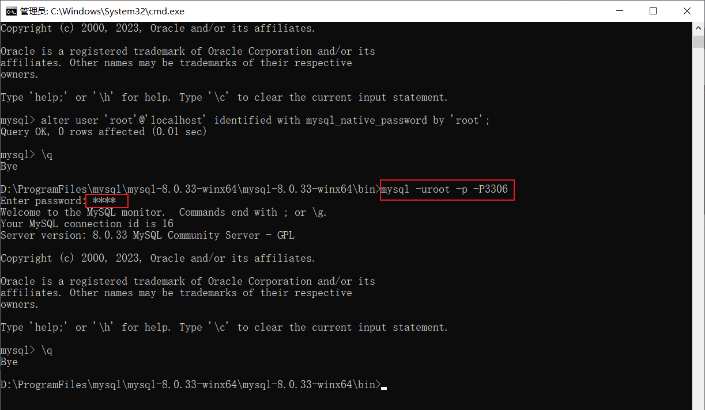

### 1.10 使用可视化软件连接 mysql

使用 SQLyog 连接本地 mysql 数据库，连接成功。

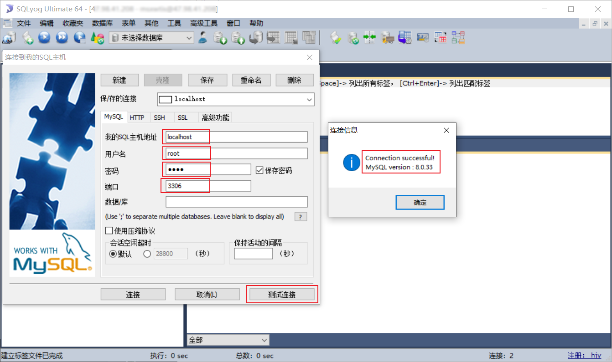

### 1.11 mysql命令

查看端口号

```mysql
show global variables like 'port';
```

使修改立即生效

```mysql
flush privileges;
```

修改mysql全局时区为北京时间

```mysql
set global time_zone = ‘+8:00’;
```

修改当前会话时区

```mysql
set time_zone = ‘+8:00’;
```


