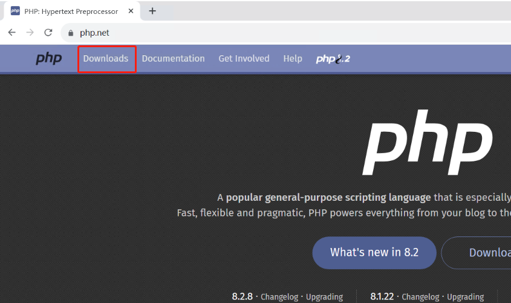
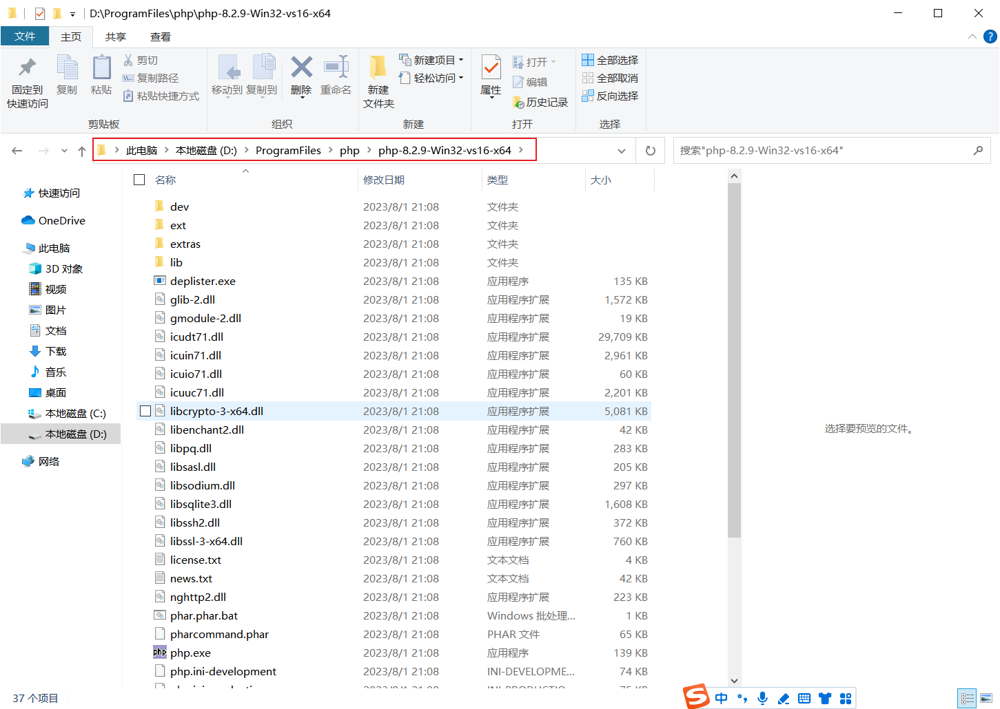
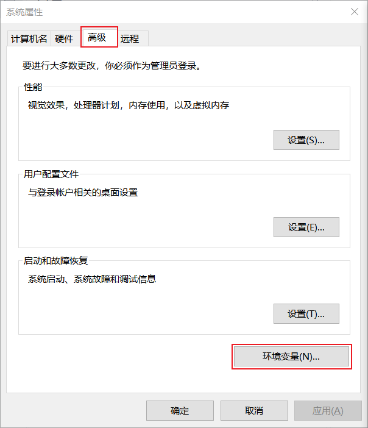
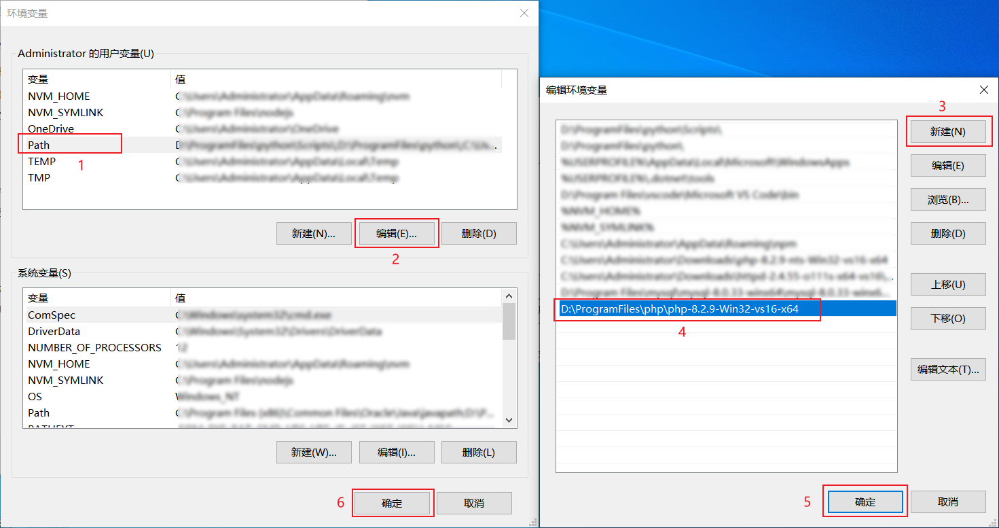
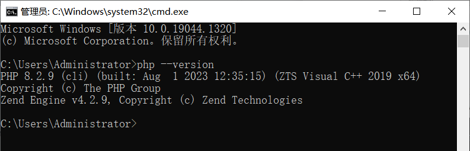
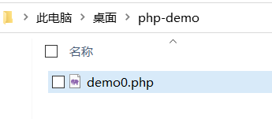

# 安装php

## Windows安装php

### 1.1 下载php压缩包

进入官网：[https://www.php.net/](https://www.php.net/)

点击Downloads跳转到下载界面。




下载Thread Safe线程安全版本的。


下载后的压缩包。


### 1.2 解压到文件夹

解压到D:\ProgramFiles\php\。



### 1.3 添加环境变量

把php压缩包解压后的地址添加到环境变量，使命令提示可以运行php。

win+r 输入 sysdm.cpl 打开系统属性，选择高级，环境变量。





### 1.4 查看php版本

查看php安装版本。



### 1.5  php内置服务器测试php网页

新建php文件demo0.php。内容如下。

```php
<html>
	<body>
		<?php 
			echo "Hello WOrld";
		?>
	</body>
</html>
```



运行，在cmd中，定位到此文件的目录，输入php -S 127.0.0.1:81

运行效果。


至此，就安装了php。


