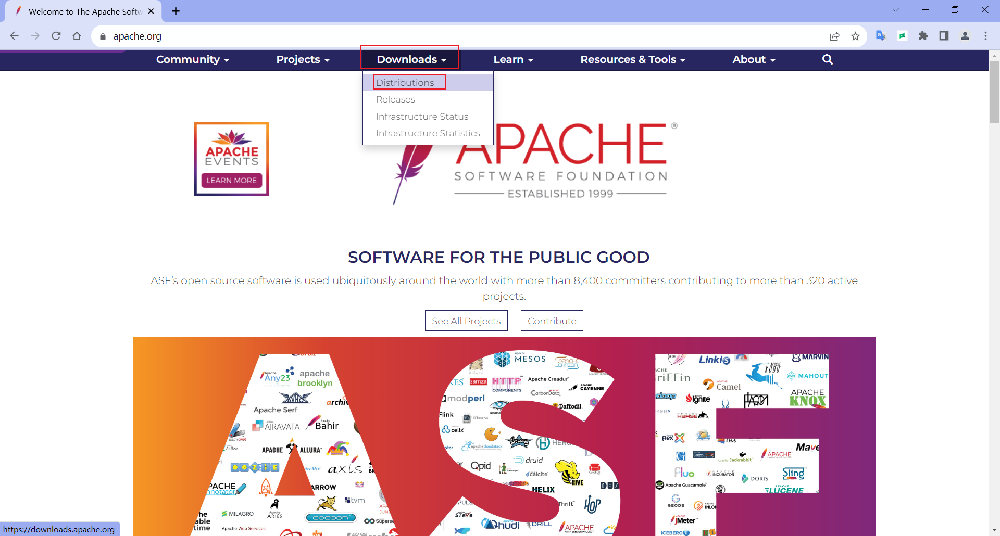
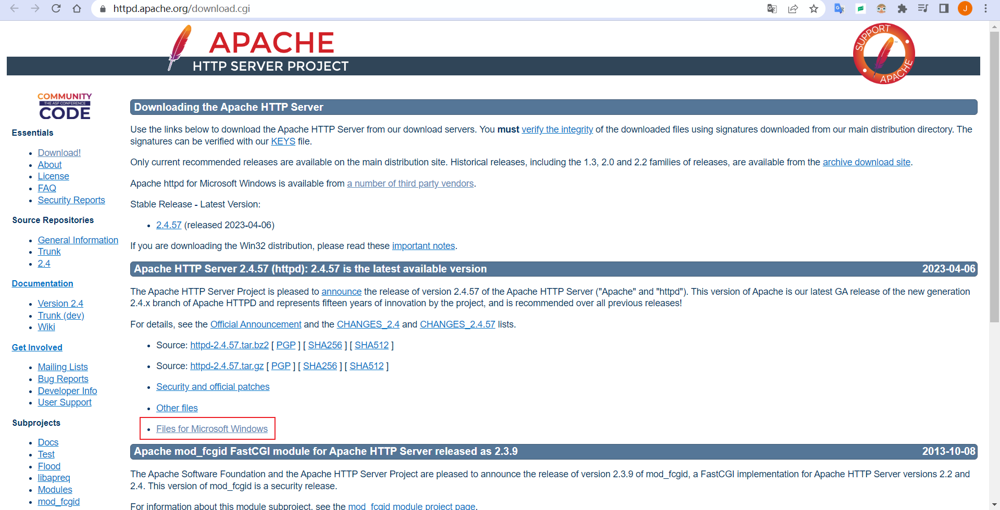
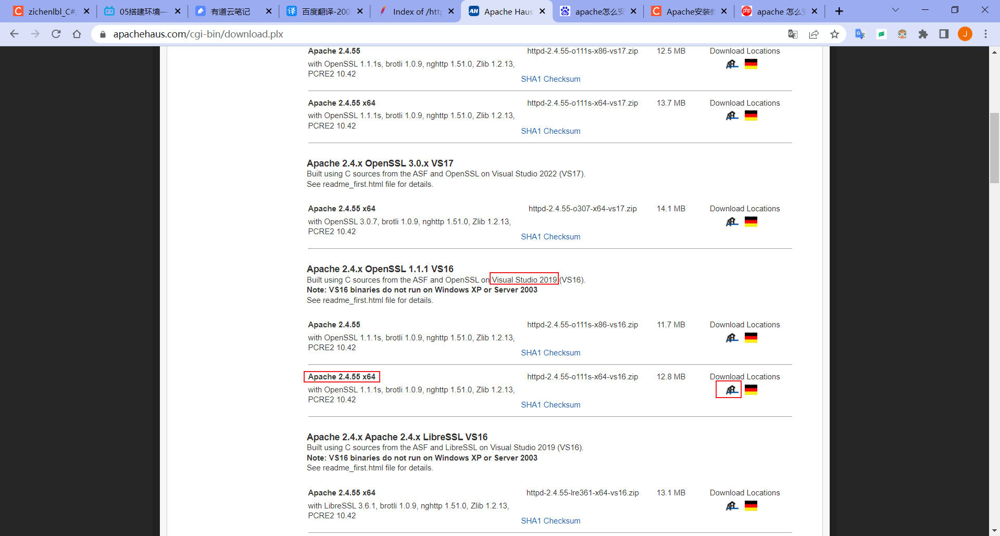
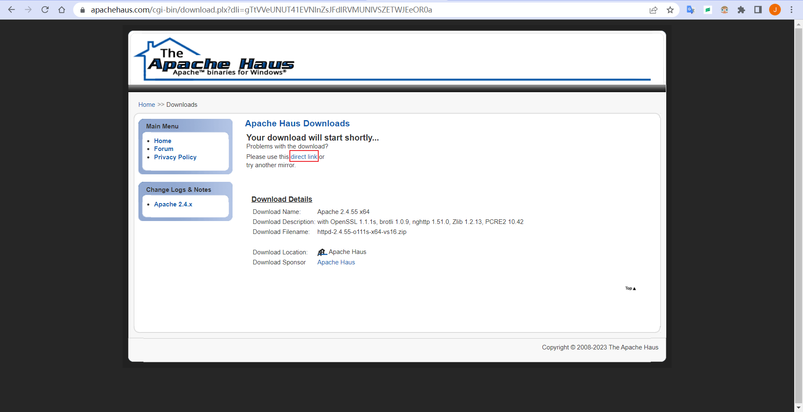
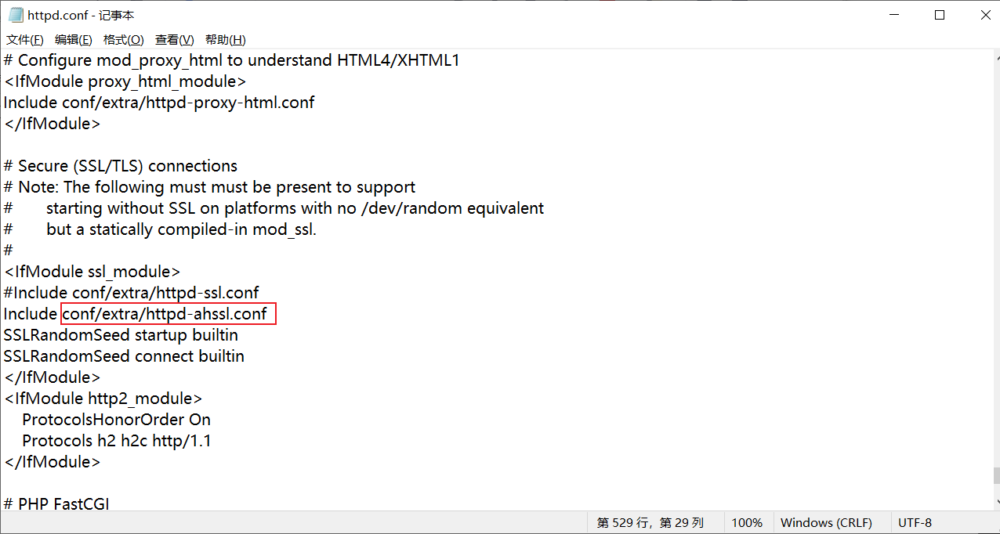
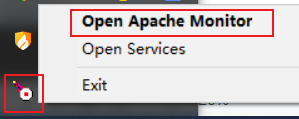
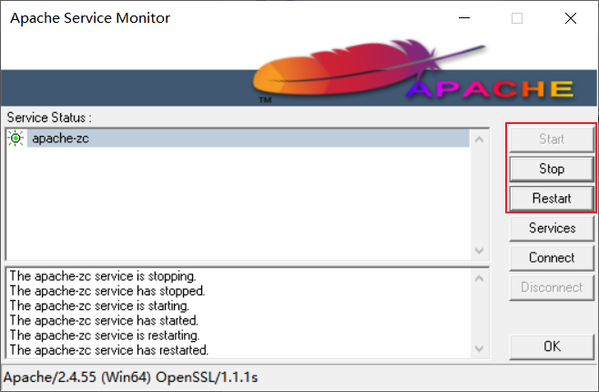
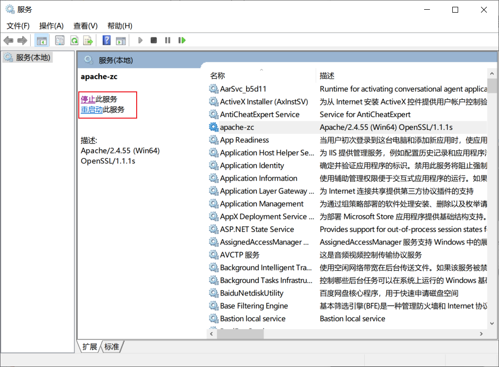
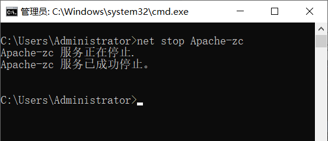

# 安装 Apache

## 1. Windows 安装 Apache

### 1.1 下载 Apache 压缩包

::: tip 参考视频

[https://www.bilibili.com/video/BV1S4411e7jq?p=6](https://www.bilibili.com/video/BV1S4411e7jq?p=6)
[https://www.bilibili.com/video/BV18x411H7qD?p=6](https://www.bilibili.com/video/BV18x411H7qD?p=6)
[https://www.bilibili.com/video/BV1Zx4y1T7Hy?p=26](https://www.bilibili.com/video/BV1Zx4y1T7Hy?p=26)

:::

进入 Apache 官网：[https://apache.org/](https://apache.org/)

点击 Downloads 下面的 Distributions 跳转到下载界面。 



找到 httpd，点击进入 httpd。


点击 httpd 界面中的 [Apache HTTP Server Download Page](http://httpd.apache.org/download.cgi) 。


点击 [Files for Microsoft Windows](https://httpd.apache.org/docs/current/platform/windows.html#down) 下载 Windows 版本。



点击第一个 [Apache Haus](https://www.apachehaus.com/cgi-bin/download.plx) 或第二个 [Apache Lounge](https://www.apachelounge.com/download/)。


跳转到下载页面。选择适合的版本，如使用 Visual Studio 2019 构建的（VS16）版本，选择 Apache 2.4.55 x64 位，点击图标下载。



另存为。


保存后的文件。


未自动下载可点击 [direct link](https://www.apachehaus.com/downloads/httpd-2.4.55-o111s-x64-vs16.zip) 进行下载。



另一个 [Apache Lounge](https://www.apachelounge.com/download/) 下载页面。


### 1.2 解压到文件夹

解压到文件夹 D:\ProgramFiles\apache\。


### 1.3 修改配置文件

修改 conf 目录下的 httpd.conf 文件。


修改 SRVROOT 的值为 Apache 安装的路径，注释原来的配置，添加一行。


修改 Apache 端口为 90。


修改网站文件存放的目录为 `"${SRVROOT}/htdocs"`，即 Apache 安装的路径下的 /htdocs 目录。


修改默认索引页面，在 DirectorIndex 后面添加 `index.html default.html index.php default.php` 等。


修改 ServerName 为 `localhost:90`。


查看 SSL 端口配置在 conf/extra/httpd-ahssl.conf 文件中。



修改 conf/extra/httpd-ahssl.conf 文件，修改 Listen 端口为 456 。


### 1.4 安装 Apache 服务

进入 Apache 安装的路径下的 bin 目录中，在地址栏上右键复制地址。


以管理员身份运行命令提示符。


输入 `d:` 切换到 D 盘根目录，然后输入 `cd 复制的地址` 切换到 Apache 安装的路径下的 bin 目录。


输入 `httpd.exe -k install -n apache-zc` 安装一个名叫 apache-zc 的服务。

`httpd.exe -t` 检查配置文件是否有错误，返回语法 OK。

`net start apache-zc` 启动一个名叫 apache-zc 的 Windows 服务。


按下 win 键 + r 键，打开运行， 输入 `services.msc` 打开服务，查看名称为 apache-zc 的 Windows 服务。


### 1.5 访问网页

打开浏览器，访问配置的 [http://localhost:90](http://localhost:90) 、[http://localhost:456](http://localhost:456) 两个端口地址，打开 Apache 测试页。


这个网页文件在 Apache 安装的路径下的 /htdocs 目录。


### 1.6 ApacheMonitor

打开 ApacheMonitor.exe，运行后不会显示界面，需要在托盘中打开界面。


右下角托盘，在图标上右键打开。



点击 Stop 停止（Start 启动、Restart 重启） apache-zc 服务；Services 打开服务界面。



### 1.7 管理 Apache 服务

#### 1.7.1 服务界面

使用服务界面管理 Apache 服务。



#### 1.7.2 命令

##### 1.7.2.1 启动服务

net start 服务名


##### 1.7.2.2 停止服务

net stop 服务名



##### 1.7.2.3 删除服务

sc delete 服务名


##### 1.7.2.4 重启服务

httpd.exe -k restart -n 服务名


## 2. Apache 加载 PHP 模块

### 2.1 创建 PHP 配置文件

复制配置文件 php.ini-development，重命名为 php.ini。


### 2.2 设置 Apache 模块

修改 Apache 的配置文件 httpd.conf，增加配置信息如下。

```ini
# 加载 PHP 模块
LoadModule php_module "D:/ProgramFiles/php/php-8.2.9-Win32-vs16-x64/php8apache2_4.dll"
# 将 PHP 配置文件加载到 Apache 配置文件中，PHP 配置文件(php.ini)所在目录
PHPIniDir "D:/ProgramFiles/php/php-8.2.9-Win32-vs16-x64"
# 增加一个类型，应用文件类型后缀名为.php的文件进行处理
AddType application/x-httpd-php .php .html .htm
```


Apache 加载 PHP 模块的路径。


然后添加默认索引页面，在 `DirectoryIndex` 后面添加 `index.php`。


### 2.3 修改 PHP 配置

修改 PHP 配置文件 php.ini。

打开调试报错开关：`display_errors = On`。


打开简写支持开关后，尖括号中 php 可以省略：`short_open_tag = On`。

例如打开后可以这样写：`<? 代码 ?>`


支持 MySQL：查找 `extension=mysqli`，复制一行然后取消注释；

查找 `extension=pdo_mysql`，复制一行然后取消注释。


### 2.4 校验配置文件

切换到 Apache 安装的路径下的 bin 目录，输入 `httpd -t` 检查 httpd.conf 配置文件是否有错误，返回语法 OK。


### 2.5 重启 Apache 服务

输入 `httpd -k restart -n apache-zc` 重启服务名为 apache-zc 的 Apache 服务，没有错误即重启成功。


### 2.6 访问 PHP 网页

在 Apache 网站文件存放的目录 htdocs 中创建一个 index.php 网页。

```php
<?php phpinfo(); ?>
```


打开浏览器，访问配置的 [http://localhost:90](http://localhost:90) 、[http://localhost:456](http://localhost:456) 两个端口地址，打开 /index.php 网页成功显示 PHP 信息。


至此，Apache 加载 PHP 模块并解析 PHP 页面就完成了。

---

Email：zicl@qq.com

Copyright 2023-2024 Zichen

Licensed under the Apache License, Version 2.0 (the “License”);
you may not use this file except in compliance with the License.
You may obtain a copy of the License at

<a target="_blank" href="http://www.apache.org/licenses/LICENSE-2.0">http://www.apache.org/licenses/LICENSE-2.0</a>

Unless required by applicable law or agreed to in writing, software
distributed under the License is distributed on an “AS IS” BASIS,
WITHOUT WARRANTIES OR CONDITIONS OF ANY KIND, either express or implied.
See the License for the specific language governing permissions and
limitations under the License.