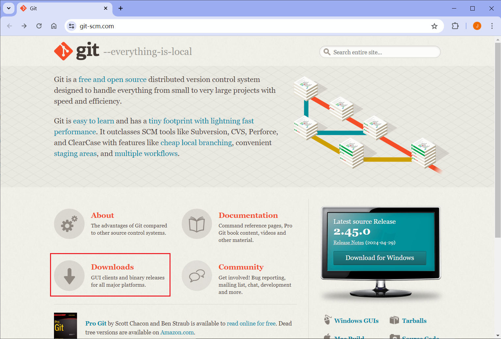
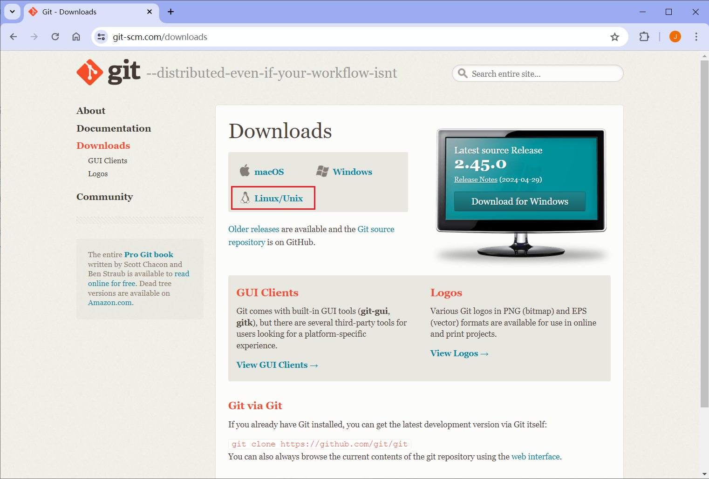
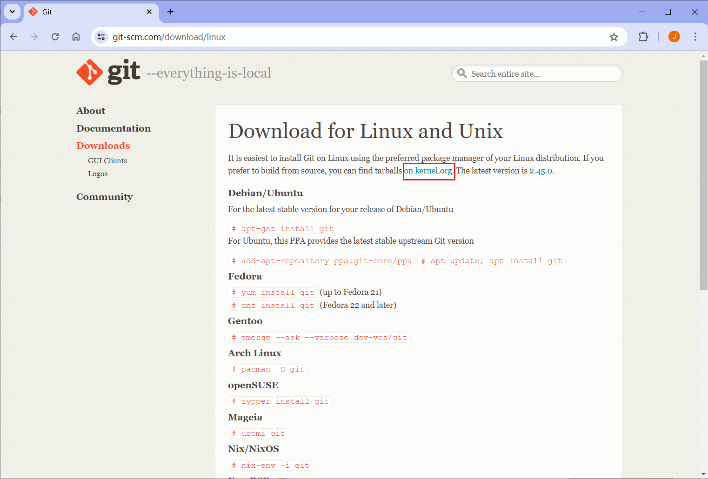
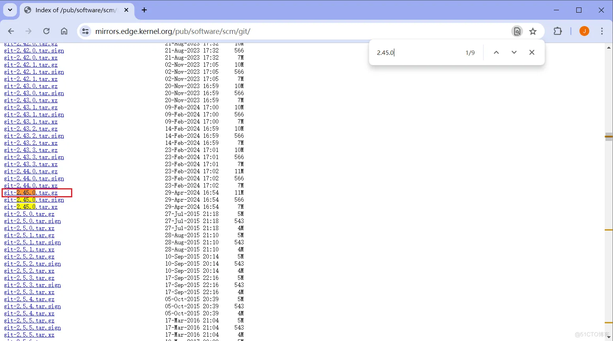
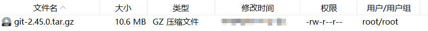
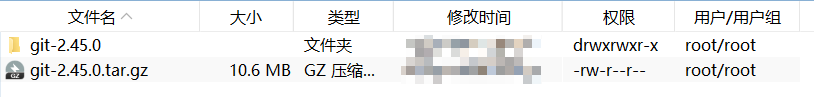
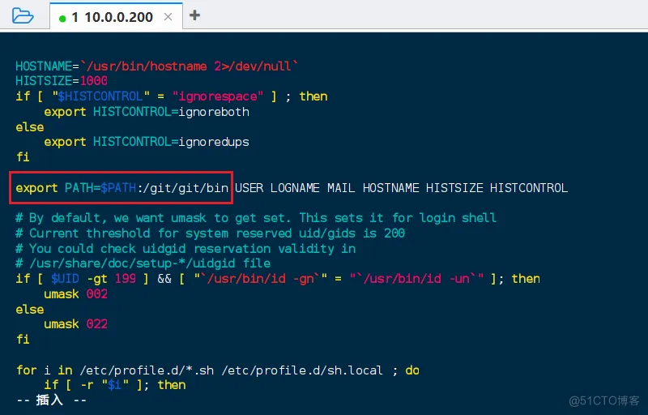
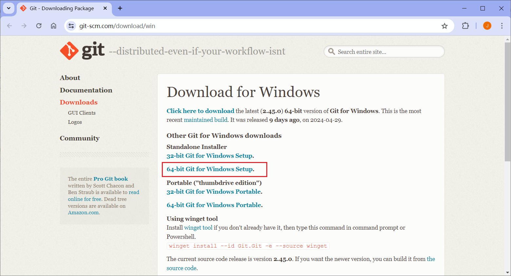

# 安装 Git

## CentOS 安装 Git

### 1.1 下载 Git 压缩包

进入 Git 官网：[https://git-scm.com/](https://git-scm.com/)

点击 Downloads 跳转到下载界面。



点击下载界面中的 [Linux/Unix](https://git-scm.com/download/linux)。



点击 [on kernel.org](https://www.kernel.org/pub/software/scm/git/)，下载源代码包。



找到源代码压缩包，下载最新版本 2.45.0，在文件名上右键，选择复制链接地址。



在 CentOS 系统中输入命令下载源代码压缩包：

`wget https://mirrors.edge.kernel.org/pub/software/scm/git/git-2.45.0.tar.gz`，

wget 后面是复制的链接地址。

完整命令：

```shell
[root@zichen35 ~]# mkdir /git
[root@zichen35 ~]# cd /git/
[root@zichen35 git]# wget https://mirrors.edge.kernel.org/pub/software/scm/git/git-2.45.0.tar.gz
--2024-01-01 11:18:08--  https://mirrors.edge.kernel.org/pub/software/scm/git/git-2.45.0.tar.gz
正在解析主机 mirrors.edge.kernel.org (mirrors.edge.kernel.org)... 147.75.48.161, 2604:1380:40f1:3f00::1
正在连接 mirrors.edge.kernel.org (mirrors.edge.kernel.org)|147.75.48.161|:443... 已连接。
已发出 HTTP 请求，正在等待回应... 200 OK
长度：11106279 (11M) [application/x-gzip]
正在保存至: “git-2.45.0.tar.gz”

100%[===============================================================================================================================================>] 11,106,279  2.90MB/s 用时 3.7s   

2024-01-01 11:18:13 (2.90 MB/s) - 已保存 “git-2.45.0.tar.gz” [11106279/11106279])

[root@zichen35 git]# ls
git-2.45.0.tar.gz
```

下载后的源代码压缩包。



### 1.2 解压到文件夹

解压压缩包到 /git/ 文件夹，使用命令：`tar -zxvf ./git-2.45.0.tar.gz`。

```shell
[root@zichen35 ~]# cd /git/
[root@zichen35 git]# ls
git-2.45.0.tar.gz
[root@zichen35 git]# tar -zxvf ./git-2.45.0.tar.gz
```

解压完成。



### 1.3 编译源代码安装

创建 /git/git/ 文件夹，安装 git 到 /git/git/ 文件夹，使用命令：`mkdir ./git/`。

```shell
[root@zichen35 git]# ls
git-2.45.0  git-2.45.0.tar.gz
[root@zichen35 git]# mkdir ./git/
[root@zichen35 git]# ls
git  git-2.45.0  git-2.45.0.tar.gz
```

进入解压后的文件夹，配置安装目录。

```shell
[root@zichen35 git]# cd ./git-2.45.0/
[root@zichen35 git-2.45.0]# ./configure --prefix=/git/git/
```

编译并安装。

```shell
[root@zichen35 git-2.45.0]# make
[root@zichen35 git-2.45.0]# make install
```

如果编译失败，需要安装以下包。

```shell
[root@zichen35 git-2.45.0]# 
```

安装 yum 包的过程会自动安装 git 到 `/usr/libexec/git-core/` 目录，所以要卸载默认安装的 git。

```shell
[root@zichen35 git-2.45.0]# yum remove git
```

### 1.4 查看 Git 版本

进入 git 安装目录，输入 ./git --version` 查看 Git 版本。

```shell
[root@zichen35 /]# cd /git/git/bin
[root@zichen35 bin]# ls
git  git-cvsserver  gitk  git-receive-pack  git-shell  git-upload-archive  git-upload-pack  scalar
[root@zichen35 bin]# ./git --version
git version 2.45.0
```

### 1.5 添加到环境变量

编辑文件。

```shell
[root@zichen35 ~]# vim /etc/profile
```

修改 `export PATH`。

修改为：`export PATH=$PATH:/git/git/bin`，将 `/git/git/bin` 目录添加到 PATH 环境变量中。



重新加载 `/etc/profile` 脚本，使修改生效。

```shell
[root@zichen35 ~]# source /etc/profile
[root@zichen35 ~]# git --version
git version 2.45.0
```

或者在最后一行添加，使用变量定义 Git 安装目录，最后导出 PATH 环境变量。

```ini
# 添加 GIT 变量
# GIT_HOME
GIT_HOME=/git/git
export PATH=$PATH:$GIT_HOME/bin
```

### 1.6 测试 Git 克隆仓库

```php
[root@zichen35 git]# git clone https://github.com/zichenlbl/docsify-starter.git
```


至此，就成功安装了 Git。

## Windows 安装 Git

### 2.1 下载 Git 软件

下载地址：[https://git-scm.com/download/win](https://git-scm.com/download/win)

根据电脑操作系统的系统类型，下载 32 位或 64 位的安装包。



然后运行安装包，安装 Git。

### 2.2 配置用户名和邮箱

配置。

```shell
git config --global user.name "Your Name"
git config --global user.email "<example@email.com>"
```

查看。

```shell
git config --global user.name
git config --global user.email
```

# Git 常用命令

af

---

Email：zicl@qq.com

Copyright 2024 Zichen

Licensed under the Apache License, Version 2.0 (the “License”);
you may not use this file except in compliance with the License.
You may obtain a copy of the License at

<a target="_blank" href="http://www.apache.org/licenses/LICENSE-2.0">http://www.apache.org/licenses/LICENSE-2.0</a>

Unless required by applicable law or agreed to in writing, software
distributed under the License is distributed on an “AS IS” BASIS,
WITHOUT WARRANTIES OR CONDITIONS OF ANY KIND, either express or implied.
See the License for the specific language governing permissions and
limitations under the License.