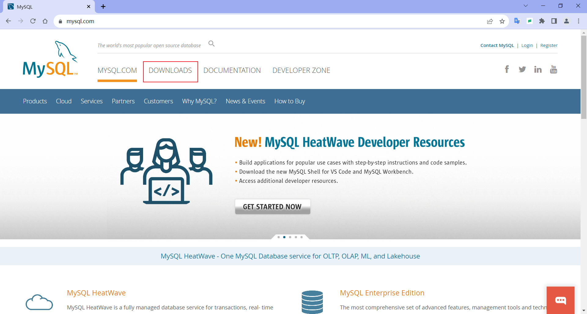
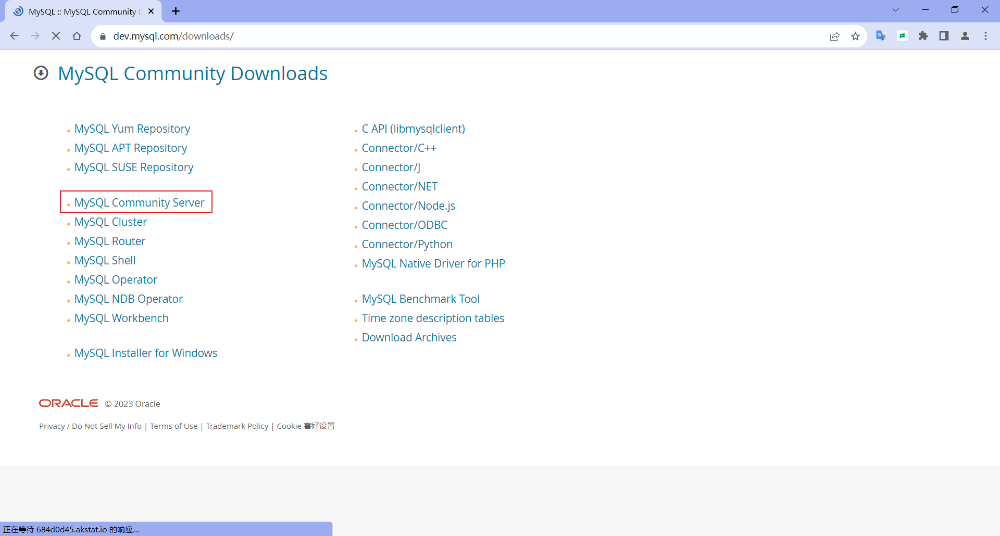
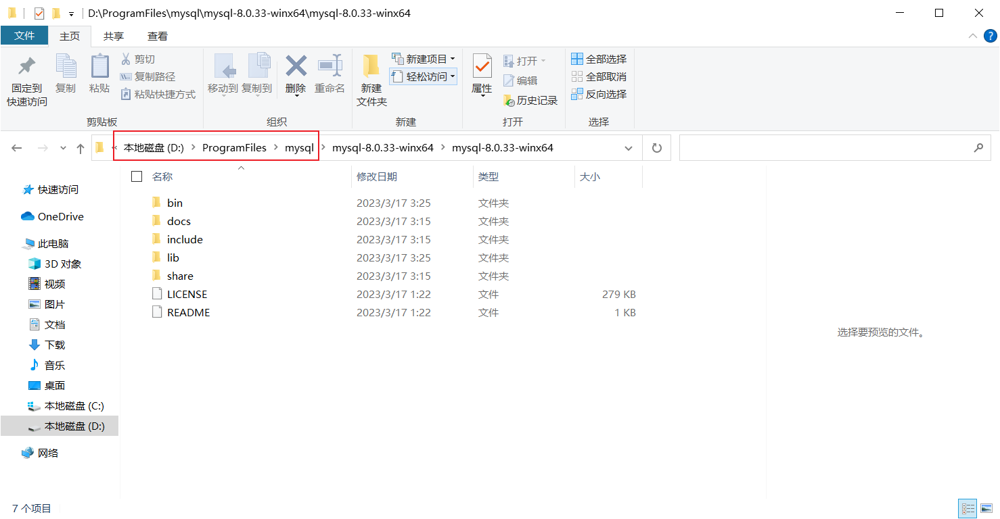
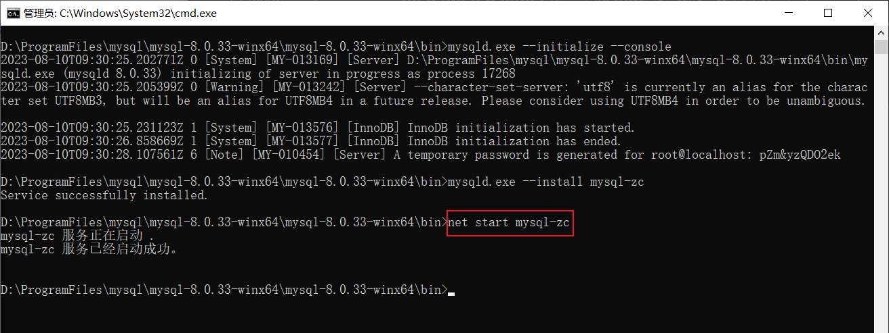
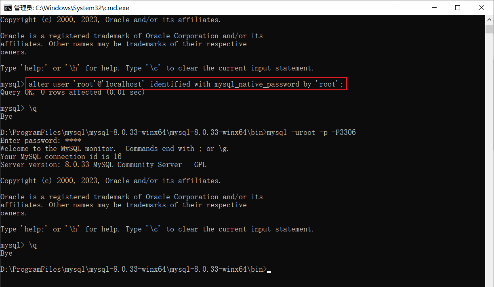
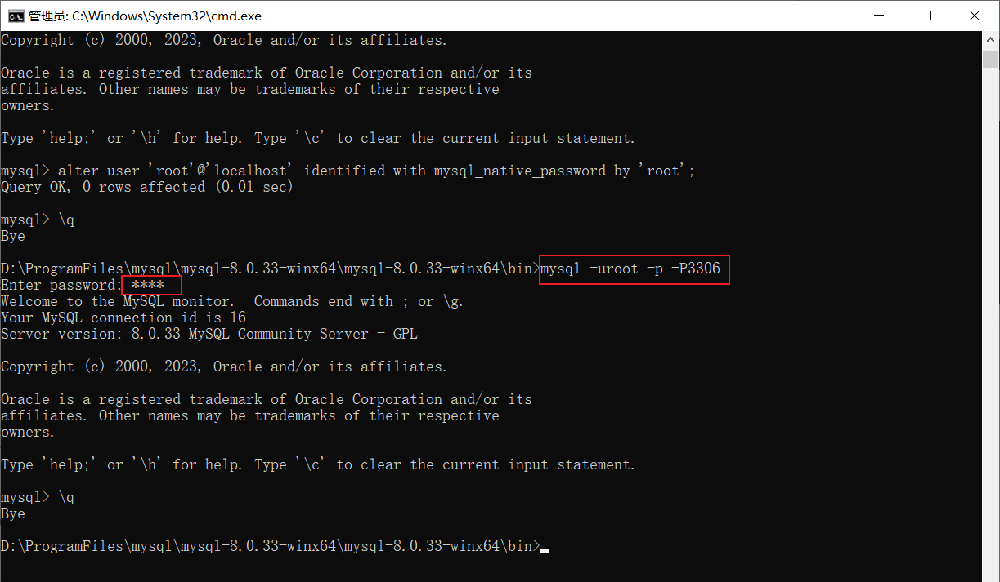

# 安装 MySQL

## Windows 安装 MySQL

### 1.1 下载 MySQL 压缩包

进入官网：[https://www.mysql.com/](https://www.mysql.com/)

点击 DOWNLOADS 跳转到下载界面。



点击下载界面中的 [MySQL Community (GPL) Downloads »](https://dev.mysql.com/downloads/) 。


选择 [MySQL Community Server](https://dev.mysql.com/downloads/mysql/)。



点击 [Archives](https://downloads.mysql.com/archives/community/) 查看档案中所有历史版本。


选择产品版本，选择操作系统，然后下载 ZIP 压缩包。


下载后的压缩包。


或者选择最新的产品版本，选择操作系统，然后下载 ZIP 压缩包。


选择 [No thanks, just start my download.](https://dev.mysql.com/get/Downloads/MySQL-8.3/mysql-8.3.0-winx64.zip)，直接开始下载 ZIP 压缩包。


### 1.2 解压到文件夹

解压到文件夹 D:\ProgramFiles\mysql\。



### 1.3 创建 my.ini 配置文件

在 \bin 目录同级下，创建 my.ini 文件。


my.ini 文件内容。

```ini
# my.ini

[mysql]
# mysql:客户端
# my.ini放在和\bin目录同级下
# 设置mysql客户端默认字符集
default-character-set=utf8
 
[mysqld]
# mysql:服务端配置
# 设置3306端口
port = 3306
# 设置mysql的安装目录
basedir=D:\\ProgramFiles\mysql\\mysql-8.0.33-winx64\\mysql-8.0.33-winx64
# 设置 mysql数据库的数据的存放目录，MySQL 8+ 不需要以下配置，系统自己生成即可，否则有可能报错
# datadir=D:\\ProgramFiles\mysql\\mysql-8.0.33-winx64\\mysql-8.0.33-winx64\\data
# 允许最大连接数
max_connections=20
# 服务端使用的字符集默认为8比特编码的latin1字符集
character-set-server=utf8
# 创建新表时将使用的默认存储引擎
default-storage-engine=INNODB

[client]
# client:客户端配置
# 设置 mysql 客户端连接服务端时默认使用的端口
port=3306
default-character-set=utf8
```

修改 basedir 值为 MySQL 安装的路径；MySQL 8 以下的版本需要修改 datadir 值为 MySQL 安装的路径下的 \\data 目录，并删除最前面的 # 注释。


### 1.4 初始化 MySQL

进入 MySQL 安装的路径下的 bin 目录中，在地址栏上右键复制地址。


以管理员身份运行命令提示符。


输入 `d:` 切换到 D 盘根目录，然后输入 `cd 复制的地址` 切换到 MySQL 安装的路径下的 bin 目录。


输入 `mysqld.exe --initialize --console` 初始化。初始化完成后，会生成一个临时密码。

选中密码，在窗体顶部右键，选择编辑，复制（或者选中密码后按 Enter 回车键）。

稍后登录 MySQL 时需要用到临时密码。


### 1.5 安装 MySQL 服务

输入 `mysqld.exe --install mysql-zc` 安装名称为 mysql-zc 的服务。提示服务安装成功。


### 1.6 启动 MySQL 服务

输入 `net start mysql-zc`，启动名称为 mysql-zc 的服务。



### 1.7 登录 MySQL

输入 `mysql.exe -uroot -p -P3306`，按回车，粘贴临时密码（或者点击鼠标右键自动粘贴）。


按回车登录 MySQL，出现 mysql> 即登录成功。


### 1.8 修改密码

修改 root 用户密码，输入 `alter user 'root'@'localhost' identified with mysql_native_password by 'root';`，修改 root 用户的密码为 root。



### 1.9 新密码登录

输入 `\q` 退出登录，然后使用新密码登录。



### 1.10 使用软件连接 MySQL

使用可视化软件 SQLyog 连接本地 MySQL 数据库，连接成功。


### 1.11 SQL 命令

查看端口号

```mysql
show global variables like 'port';
```

使修改立即生效

```mysql
flush privileges;
```

修改mysql全局时区为北京时间

```mysql
set global time_zone = '+8:00';
```

修改当前会话时区

```mysql
set time_zone = '+8:00';
```

修改指定用户的登录密码

```mysql
alter user '用户名'@'localhost' identified with mysql_native_password by '新密码';
```

---

Email：zicl@qq.com

Copyright 2023-2024 Zichen

Licensed under the Apache License, Version 2.0 (the “License”);
you may not use this file except in compliance with the License.
You may obtain a copy of the License at

<a target="_blank" href="http://www.apache.org/licenses/LICENSE-2.0">http://www.apache.org/licenses/LICENSE-2.0</a>

Unless required by applicable law or agreed to in writing, software
distributed under the License is distributed on an “AS IS” BASIS,
WITHOUT WARRANTIES OR CONDITIONS OF ANY KIND, either express or implied.
See the License for the specific language governing permissions and
limitations under the License.


