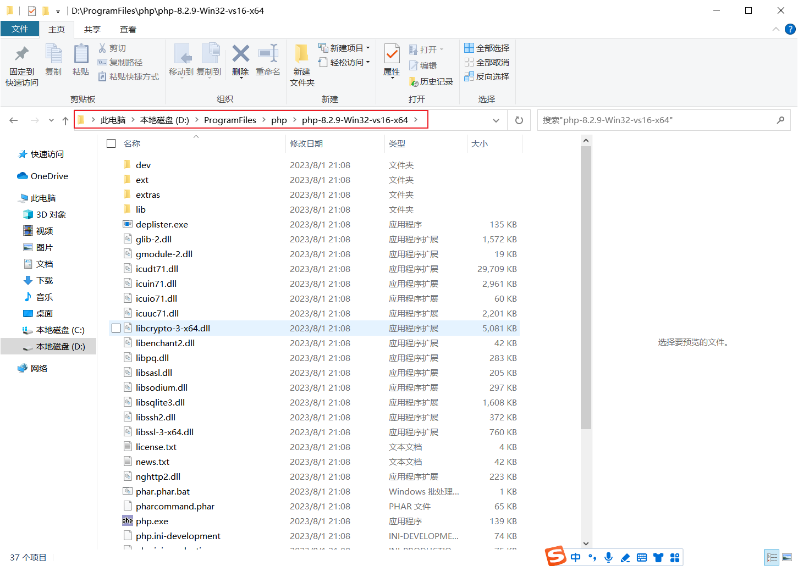
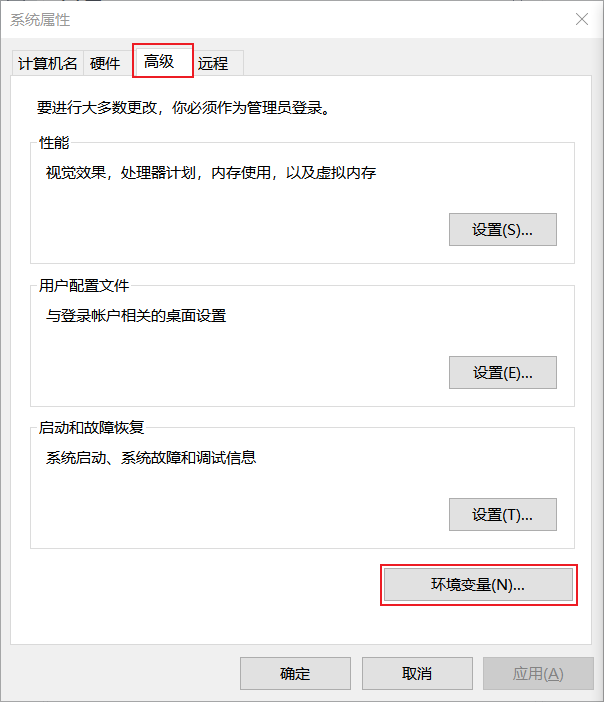

# 安装 PHP

## 1. Windows 安装 PHP

### 1.1 下载 PHP 压缩包

进入 PHP 官网：[https://www.php.net/](https://www.php.net/)

点击 Downloads 跳转到下载界面。


点击下载界面中的 [Windows 下载](https://windows.php.net/download)。


下载 Thread Safe 线程安全版本的 PHP 安装文件（Zip 压缩包）。


下载后的压缩包。


### 1.2 解压到文件夹

解压到文件夹 D:\ProgramFiles\php\。



PHP 目录结构说明。


### 1.3 添加到环境变量

把 PHP 压缩包解压后的地址添加到环境变量 Path 变量中，使命令提示符可以找到并运行 php。

按下 win 键 + r 键，打开运行， 输入 `sysdm.cpl` 打开系统属性，选择高级，环境变量。





### 1.4 查看 PHP 版本

以管理员身份运行命令提示符，输入 `php --version` 查看 PHP 版本。


### 1.5 测试 PHP 网页

新建 PHP 网页 demo0.php，内容如下。

```php
<html>
	<body>
		<?php 
			echo "Hello WOrld";
		?>
	</body>
</html>
```


运行，在命令提示符中，定位到此文件的目录，输入 `php -S 127.0.0.1:81`，运行效果。


至此，就成功安装了 PHP。

---

Email：zicl@qq.com

Copyright 2023-2024 Zichen

Licensed under the Apache License, Version 2.0 (the “License”);
you may not use this file except in compliance with the License.
You may obtain a copy of the License at

<a target="_blank" href="http://www.apache.org/licenses/LICENSE-2.0">http://www.apache.org/licenses/LICENSE-2.0</a>

Unless required by applicable law or agreed to in writing, software
distributed under the License is distributed on an “AS IS” BASIS,
WITHOUT WARRANTIES OR CONDITIONS OF ANY KIND, either express or implied.
See the License for the specific language governing permissions and
limitations under the License.