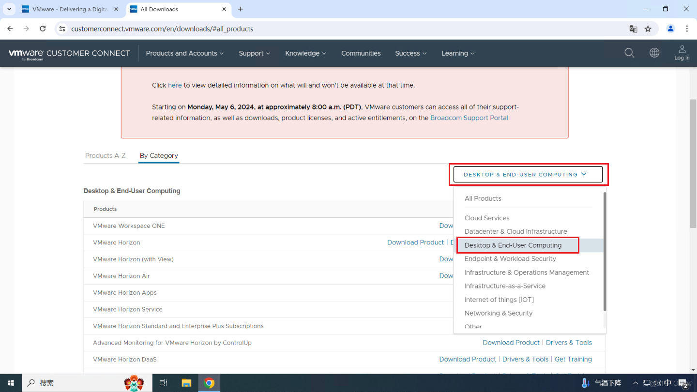
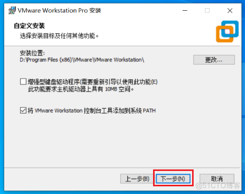
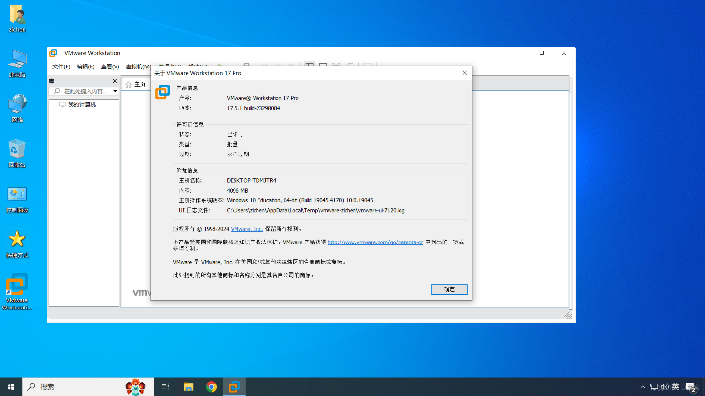

# 安装 VMware

## Windows 安装 VMware

### 1.1 下载 VMware

进入 WMware 官网：[https://www.vmware.com](https://www.vmware.com)，点击 Resources（资源），点击 [Product Downloads](https://customerconnect.vmware.com/en/downloads)（产品下载）。

选择 Desktop & End-User Computing（桌面与终端用户计算）。

选择 VMware Workstation Pro 后面的 [Download Product](https://customerconnect.vmware.com/en/downloads/info/slug/desktop_end_user_computing/vmware_workstation_pro/17_0)（下载产品）。

选择 [GO TO DOWNLOADS](https://customerconnect.vmware.com/en/downloads/details?downloadGroup=WKST-1751-WIN&productId=1376&rPId=116853)（转到下载）

选择 DOWNLOAD NOW（立即下载）。

注册账号登录后进行下载。

下载完后的安装程序。

### 1.2 安装 VMware

双击运行安装程序。

JU090-6039P-08409-8J0QH-2YR7F
> [https://www.isharepc.com/36181.html](https://www.isharepc.com/36181.html)

---

Email：zicl@qq.com

Copyright 2024 Zichen

Licensed under the Apache License, Version 2.0 (the “License”);
you may not use this file except in compliance with the License.
You may obtain a copy of the License at

<a target="_blank" href="http://www.apache.org/licenses/LICENSE-2.0">http://www.apache.org/licenses/LICENSE-2.0</a>

Unless required by applicable law or agreed to in writing, software
distributed under the License is distributed on an “AS IS” BASIS,
WITHOUT WARRANTIES OR CONDITIONS OF ANY KIND, either express or implied.
See the License for the specific language governing permissions and
limitations under the License.